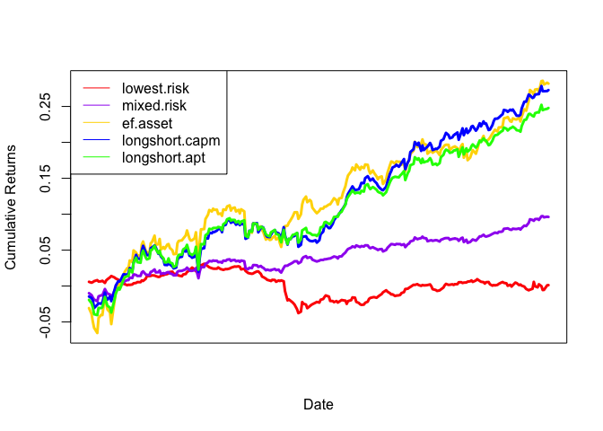
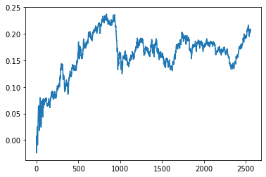

# Financial Portfolio Management, Forecasting, and Optimization 

This repo explores various portfolio management theories, forecasting techniques, and optimization algorithms for financial portfolio management using ETF and macroeconomic data from Reuter's Datastream1 and Wharton Research Data Services.2

The initial portfolio simulated on over 10 years is comprised of 11 ETFs and 31 additional financial and macroeconomic predictors was inspired by Obeidat et. al's3 paper on adaptive portfolio asset allocation optimization. 

## CAPM Portfolio Returns vs. APT Portfolio Returns vs. Efficient Frontier Asset Returns

## Deep Learning Approach with MVO

After a pre-training period of 400 business days, I make next-day predictions for all 11 ETF values based on a 10-day sliding window of previous ETF values and other macroeconomic and financial predictors and then immediately adjust the portfolio weights using a mean-variance optimization algorithm, which maximizes expected return with respect to 10-day volatility observed in each of the assets. Resulting cumulative portfolio returns are below:

## Citations 

1 https://infobase.thomsonreuters.com/

2 https://wrds-www.wharton.upenn.edu/

3  Obeidat, Samer, Shapiro, Daniel, Lemay, Mathieu, MacPherson, Mary Kate, & Bolic, Miodrag (2018). Adaptive Portfolio Asset Allocation Optimization with Deep Learning. _International Journal on Advances in Intelligent Systems, 11(1&2), 25-34_.
