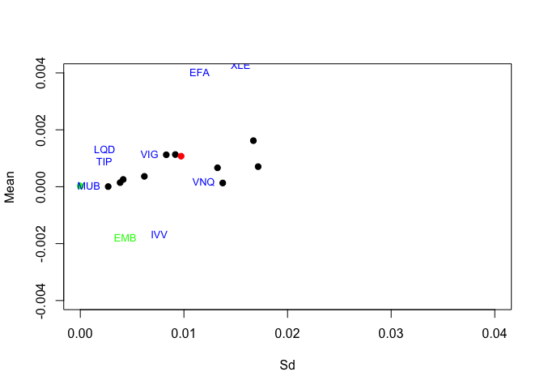
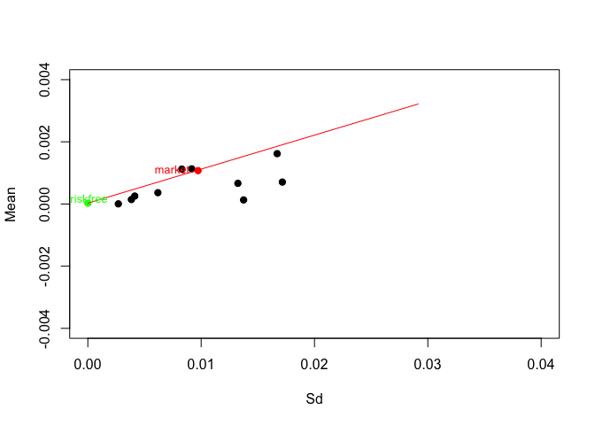
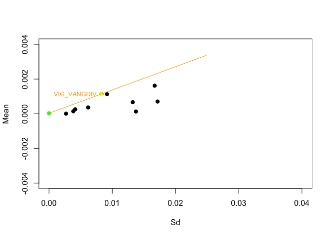
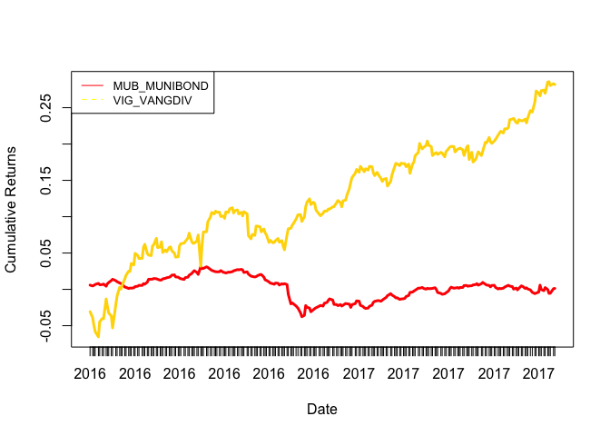
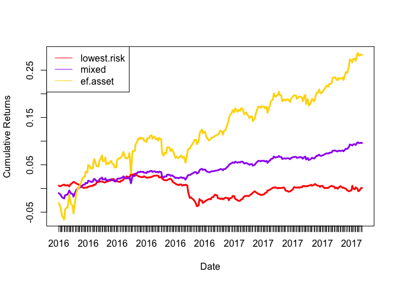
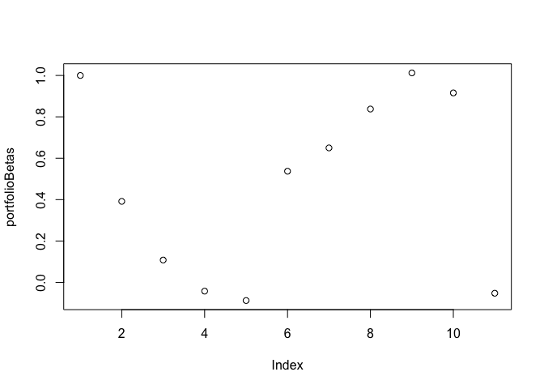
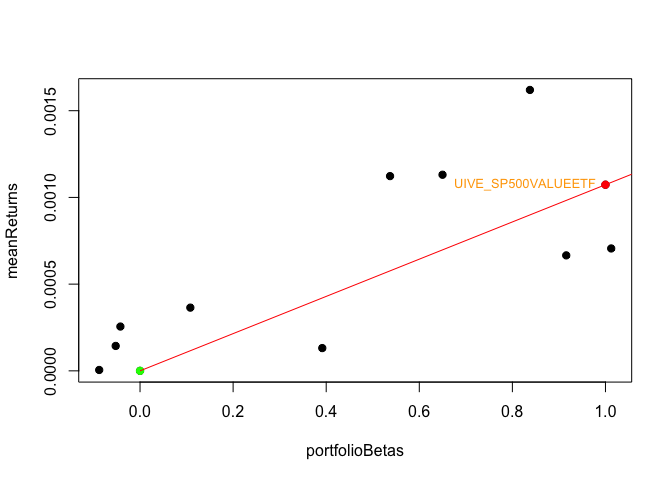
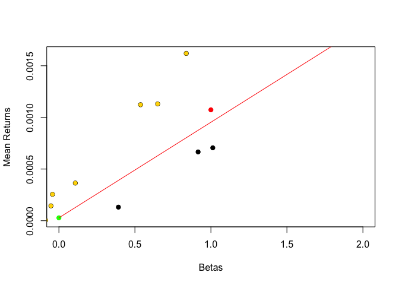
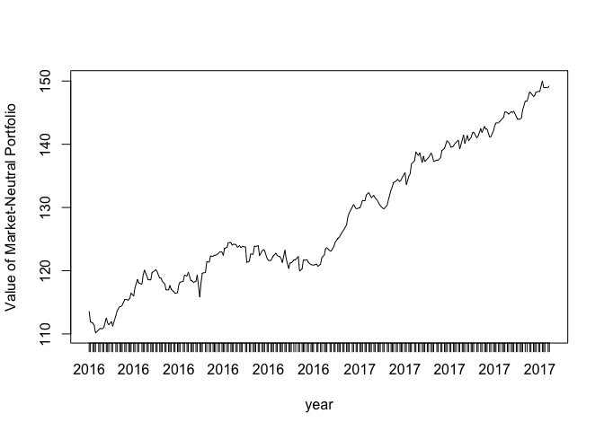
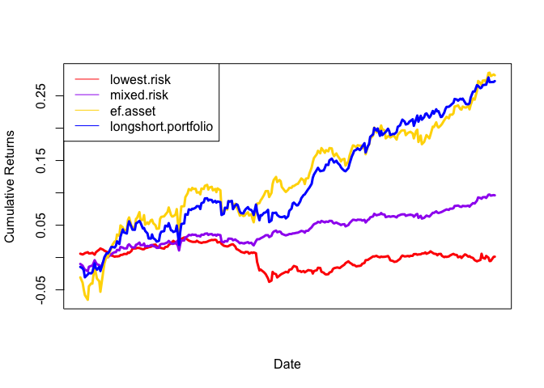

capm
================

### Read in portfolio asset and macroeconomic data:

``` r
econ = c('CHNGDP','USGDP','EZGDP','US_UNEMP')

shock = c('CHNGDP_Shock','USGDP_Shock','EZGDP_Shock','US_UNEMP_Shock')

finstruments = c('UST_10YR','USFFR','USDRMB','CRUDOIL','CFE_VIX','USDEUR','UST_2YR',
             'SP500_GSCI','USDOIS','UIVE_SP500VALUEETF','USDJPY','USDGBP')

assets = c('VNQ_VANGREALEST','EMB_USDEMRGBOND','LQD_CORPBOND',
            'MUB_MUNIBOND','SHY_1-3USTR','VIG_VANGDIV','IVV_SP500','EEM_MSCIEMERGING',
            'XLE_ENERGYSPDR','EFA_MSCIEAFE','TIP_TIPSBOND')

dataPath = "/Users/chrisolen/Documents/uchicago_courses/deep_learning_and_image_recognition/finance/fin-portfolio-mvo/data"
dat = read.csv(paste(dataPath,"data_cleaned.csv",sep="/"), header=TRUE)
head(dat)
```

    ##        date UST_10YR UIVE_SP500VALUEETF VNQ_VANGREALEST USFFR
    ## 1  1/8/2008   3.8389              74.28         55.4900  4.27
    ## 2  1/9/2008   3.7899              72.72         56.4700  4.26
    ## 3 1/10/2008   3.8858              72.72         57.3400  4.26
    ## 4 1/11/2008   3.8065              73.57         57.3500  4.23
    ## 5 1/14/2008   3.7893              73.95         57.1101  4.24
    ## 6 1/15/2008   3.6995              73.10         55.9500  4.24
    ##   EMB_USDEMRGBOND LQD_CORPBOND MUB_MUNIBOND SHY_1.3USTR  USDJPY  USDGBP
    ## 1         102.197      106.270       101.85       82.66 0.91798 1.97279
    ## 2         102.120      106.050       102.11       82.62 0.90921 1.95768
    ## 3         102.210      105.738       101.96       82.62 0.91370 1.96169
    ## 4         101.838      106.510       102.09       82.85 0.91882 1.95715
    ## 5         102.190      106.070       102.55       82.88 0.92349 1.95273
    ## 6         102.360      106.640       103.11       82.95 0.93523 1.95762
    ##   VIG_VANGDIV IVV_SP500 USDRMB CRUDOIL CFE_VIX EEM_MSCIEMERGING   USDEUR
    ## 1       53.72    139.21 7.2657   96.34   24.10          48.2000 0.679833
    ## 2       54.18    141.05 7.2646   95.68   25.00          49.7800 0.682151
    ## 3       54.66    142.04 7.2724   93.72   24.42          50.3667 0.675288
    ## 4       53.90    140.32 7.2635   92.70   25.01          48.9500 0.676567
    ## 5       54.23    141.75 7.2525   94.21   24.99          49.6700 0.672744
    ## 6       53.26    138.24 7.2431   91.91   25.04          47.4233 0.676704
    ##   XLE_ENERGYSPDR SP500_GSCI EFA_MSCIEAFE TIP_TIPSBOND UST_2YR USDOIS
    ## 1          75.85    620.906        26.14       107.03  2.7607  4.059
    ## 2          76.85    616.887        26.48       106.95  2.6785  4.055
    ## 3          76.53    607.434        26.28       106.47  2.7103  3.994
    ## 4          75.60    605.848        25.71       107.26  2.5936  3.873
    ## 5          77.10    615.283        25.91       107.71  2.5764  3.859
    ## 6          73.91    604.946        25.08       108.26  2.5305  3.866
    ##    CHNGDP    USGDP EZGDP US_UNEMP CHNGDP_Shock USGDP_Shock EZGDP_Shock
    ## 1 85399.6 15671.38  2616        5            0           0           0
    ## 2 85399.6 15671.38  2616        5            0           0           0
    ## 3 85399.6 15671.38  2616        5            0           0           0
    ## 4 85399.6 15671.38  2616        5            0           0           0
    ## 5 85399.6 15671.38  2616        5            0           0           0
    ## 6 85399.6 15671.38  2616        5            0           0           0
    ##   US_UNEMP_Shock   VNQ_VOL   EMB_VOL   LQD_VOL   MUB_VOL   VIG_VOL
    ## 1              0 2.2447160 0.2735705 0.3422718 0.1632483 0.5882431
    ## 2              0 1.4362277 0.2342430 0.3458034 0.1242176 0.5063793
    ## 3              0 0.8041952 0.2064263 0.3429531 0.1096814 0.3640330
    ## 4              0 0.8482511 0.1629478 0.3199825 0.1052141 0.3943602
    ## 5              0 0.7911624 0.1565631 0.2861971 0.2664958 0.3584969
    ## 6              5 0.6148116 0.1919239 0.3682836 0.4727367 0.5167011
    ##    IVV_VOL   EEM_VOL   EFA_VOL   XLE_VOL    SHY_VOL    TIP_VOL
    ## 1 2.430027 0.6720562 0.3750067 1.8485183 0.12223339 0.15833509
    ## 2 1.997616 0.7895796 0.3016952 1.7215894 0.07368853 0.03464102
    ## 3 1.117511 0.9867245 0.1288410 0.6377539 0.04449719 0.22821043
    ## 4 1.159634 0.8867787 0.2902068 0.6711408 0.11584472 0.28778464
    ## 5 1.143866 0.8357762 0.3027045 0.6424407 0.12837445 0.45296799
    ## 6 1.517778 1.1325228 0.5452247 1.2982180 0.15404545 0.68887590

### Extract just the portfolio assets, risk free rate, and market indicator:

``` r
cols.use <- names(dat)[names(dat) %in% assets]
risk.free.rate <- "USFFR"
market.indicator <- "UIVE_SP500VALUEETF"
full.history <- dat[,c("date",risk.free.rate,market.indicator,cols.use)]
full.history[,"date"] = as.Date(full.history[,"date"], format = "%m/%d/%Y")
head(full.history)
```

    ##         date USFFR UIVE_SP500VALUEETF VNQ_VANGREALEST EMB_USDEMRGBOND
    ## 1 2008-01-08  4.27              74.28         55.4900         102.197
    ## 2 2008-01-09  4.26              72.72         56.4700         102.120
    ## 3 2008-01-10  4.26              72.72         57.3400         102.210
    ## 4 2008-01-11  4.23              73.57         57.3500         101.838
    ## 5 2008-01-14  4.24              73.95         57.1101         102.190
    ## 6 2008-01-15  4.24              73.10         55.9500         102.360
    ##   LQD_CORPBOND MUB_MUNIBOND VIG_VANGDIV IVV_SP500 EEM_MSCIEMERGING
    ## 1      106.270       101.85       53.72    139.21          48.2000
    ## 2      106.050       102.11       54.18    141.05          49.7800
    ## 3      105.738       101.96       54.66    142.04          50.3667
    ## 4      106.510       102.09       53.90    140.32          48.9500
    ## 5      106.070       102.55       54.23    141.75          49.6700
    ## 6      106.640       103.11       53.26    138.24          47.4233
    ##   XLE_ENERGYSPDR EFA_MSCIEAFE TIP_TIPSBOND
    ## 1          75.85        26.14       107.03
    ## 2          76.85        26.48       106.95
    ## 3          76.53        26.28       106.47
    ## 4          75.60        25.71       107.26
    ## 5          77.10        25.91       107.71
    ## 6          73.91        25.08       108.26

``` r
cat("portfolio dimensions:", dim(full.history))
```

    ## portfolio dimensions: 2959 13

### Determine Year(s) of Analysis

``` r
year <- c(2016,2017)
portfolio <- subset(full.history, format(as.Date(date),"%Y")==year)
```

    ## Warning in format(as.Date(date), "%Y") == year: longer object length is not
    ## a multiple of shorter object length

``` r
portfolio
```

    ##            date USFFR UIVE_SP500VALUEETF VNQ_VANGREALEST EMB_USDEMRGBOND
    ## 2013 2016-01-05  0.36              87.68         80.2900         105.950
    ## 2015 2016-01-07  0.36              84.98         78.5100         105.440
    ## 2017 2016-01-11  0.36              83.79         77.9000         105.170
    ## 2019 2016-01-13  0.36              84.21         76.2700         104.270
    ## 2021 2016-01-15  0.36              81.12         75.5700         103.360
    ## 2023 2016-01-20  0.37              80.02         73.9300         103.110
    ## 2025 2016-01-22  0.38              82.16         76.4100         104.550
    ## 2027 2016-01-26  0.38              81.11         77.5200         104.400
    ## 2029 2016-01-28  0.38              82.53         75.4400         105.450
    ## 2031 2016-02-01  0.38              83.66         77.1200         104.880
    ## 2033 2016-02-03  0.38              82.73         76.9300         105.110
    ## 2035 2016-02-05  0.38              83.46         75.5100         105.130
    ## 2037 2016-02-09  0.38              81.00         72.0000         104.320
    ## 2039 2016-02-11  0.38              79.94         71.4700         104.300
    ## 2041 2016-02-16  0.38              82.77         73.6200         105.050
    ## 2043 2016-02-18  0.38              84.56         75.0000         106.110
    ## 2045 2016-02-22  0.38              84.85         76.1500         106.540
    ## 2047 2016-02-24  0.38              83.39         75.8600         106.540
    ## 2049 2016-02-26  0.37              85.95         77.0100         107.090
    ## 2051 2016-03-01  0.36              85.26         78.8700         108.060
    ## 2053 2016-03-03  0.37              87.16         79.8600         107.930
    ## 2055 2016-03-07  0.36              87.73         80.0800         108.400
    ## 2057 2016-03-09  0.36              87.93         79.7000         108.230
    ## 2059 2016-03-11  0.36              88.73         81.1900         108.840
    ## 2061 2016-03-15  0.37              88.37         81.2400         107.990
    ## 2063 2016-03-17  0.37              89.42         83.3800         109.910
    ## 2065 2016-03-21  0.37              90.60         81.3600         110.410
    ## 2067 2016-03-23  0.37              89.80         80.9200         109.510
    ## 2069 2016-03-28  0.37              89.33         81.6800         109.460
    ## 2071 2016-03-30  0.37              90.24         83.2900         110.140
    ## 2073 2016-04-01  0.37              89.26         83.6900         110.210
    ## 2075 2016-04-05  0.37              89.37         83.0200         109.890
    ## 2077 2016-04-07  0.37              89.18         82.7000         109.700
    ## 2079 2016-04-11  0.37              89.39         82.9900         110.540
    ## 2081 2016-04-13  0.37              90.56         83.2200         111.150
    ## 2083 2016-04-15  0.37              91.20         83.3800         111.350
    ## 2085 2016-04-19  0.37              91.89         83.8200         111.840
    ## 2087 2016-04-21  0.37              92.60         80.9300         111.530
    ## 2089 2016-04-25  0.37              92.19         82.4900         110.910
    ## 2091 2016-04-27  0.37              92.64         82.7600         111.510
    ## 2093 2016-04-29  0.30              92.09         81.8300         111.630
    ## 2095 2016-05-03  0.37              91.63         83.2300         110.950
    ## 2097 2016-05-05  0.37              91.02         84.6600         110.945
    ## 2099 2016-05-09  0.37              90.85         86.5300         110.810
    ## 2101 2016-05-11  0.37              91.64         84.6700         111.560
    ## 2103 2016-05-13  0.37              91.09         84.4000         111.850
    ## 2105 2016-05-17  0.37              90.89         83.6200         111.830
    ## 2107 2016-05-19  0.37              90.09         81.3900         110.370
    ## 2109 2016-05-23  0.37              90.72         82.0500         110.490
    ## 2111 2016-05-25  0.37              91.92         83.0700         111.060
    ## 2113 2016-05-27  0.37              92.45         83.6800         111.040
    ## 2115 2016-06-01  0.37              92.26         83.7400         110.920
    ## 2117 2016-06-03  0.37              92.69         84.5100         112.000
    ## 2119 2016-06-07  0.37              93.59         84.3700         112.390
    ## 2121 2016-06-09  0.37              93.57         85.1000         112.840
    ## 2123 2016-06-13  0.37              92.54         84.7200         112.000
    ## 2125 2016-06-15  0.37              92.05         85.3000         111.930
    ## 2127 2016-06-17  0.38              92.12         85.6400         111.840
    ## 2129 2016-06-21  0.38              92.30         85.3200         112.510
    ## 2131 2016-06-23  0.39              93.14         85.6200         113.270
    ## 2133 2016-06-27  0.41              89.24         84.9200         112.650
    ## 2135 2016-06-29  0.41              90.65         87.7600         114.620
    ## 2137 2016-07-01  0.41              92.88         88.7000         115.060
    ## 2139 2016-07-06  0.40              91.77         89.2900         115.480
    ## 2141 2016-07-08  0.40              93.12         89.8000         116.360
    ## 2143 2016-07-12  0.40              94.61         90.3900         116.290
    ## 2145 2016-07-14  0.40              95.75         90.0800         116.400
    ## 2147 2016-07-18  0.40              95.54         90.3500         116.210
    ## 2149 2016-07-20  0.40              95.73         90.8000         116.190
    ## 2151 2016-07-22  0.40              95.48         91.7800         116.200
    ## 2153 2016-07-26  0.40              95.52         91.1600         115.580
    ## 2155 2016-07-28  0.40              95.18         91.2900         115.820
    ## 2157 2016-08-01  0.40              95.42         92.6500         115.250
    ## 2159 2016-08-03  0.40              94.30         90.6400         115.140
    ## 2161 2016-08-05  0.40              95.26         90.3300         115.610
    ## 2163 2016-08-09  0.40              95.82         90.9800         116.840
    ## 2165 2016-08-11  0.40              95.66         89.8500         117.000
    ## 2167 2016-08-15  0.40              96.15         90.1400         117.640
    ## 2169 2016-08-17  0.40              95.79         89.4200         117.690
    ## 2171 2016-08-19  0.40              96.26         88.5200         117.420
    ## 2173 2016-08-23  0.40              96.41         89.0500         117.670
    ## 2175 2016-08-25  0.40              95.75         89.0600         117.260
    ## 2177 2016-08-29  0.40              95.68         89.0500         117.690
    ## 2179 2016-08-31  0.30              96.12         88.9700         117.220
    ## 2181 2016-09-02  0.40              96.18         89.5200         116.920
    ## 2183 2016-09-07  0.40              96.45         90.7500         117.970
    ## 2185 2016-09-09  0.40              95.98         86.0900         116.280
    ## 2187 2016-09-13  0.40              94.89         84.3400         114.980
    ## 2189 2016-09-15  0.40              93.57         84.9300         115.680
    ## 2191 2016-09-19  0.40              94.38         85.7400         115.760
    ## 2193 2016-09-21  0.40              94.46         86.7100         117.150
    ## 2195 2016-09-23  0.40              95.50         88.5300         117.240
    ## 2197 2016-09-27  0.40              93.66         87.8000         117.210
    ## 2199 2016-09-29  0.40              94.89         87.3400         116.860
    ## 2201 2016-10-03  0.40              94.79         85.1200         116.940
    ## 2203 2016-10-05  0.40              94.48         82.2600         116.460
    ## 2205 2016-10-07  0.40              95.00         82.1500         116.350
    ## 2207 2016-10-11  0.41              94.83         81.8600         115.850
    ## 2209 2016-10-13  0.41              93.28         83.4500         116.120
    ## 2211 2016-10-17  0.41              93.59         83.2600         115.570
    ## 2213 2016-10-19  0.41              93.97         83.9700         115.900
    ## 2215 2016-10-21  0.41              93.51         83.4700         116.480
    ## 2217 2016-10-25  0.41              93.88         83.5100         116.520
    ## 2219 2016-10-27  0.41              94.29         80.2600         114.850
    ## 2221 2016-10-31  0.31              93.66         81.7600         114.690
    ## 2223 2016-11-02  0.41              92.82         78.8100         114.000
    ## 2225 2016-11-04  0.41              92.34         78.8200         114.020
    ## 2227 2016-11-08  0.41              93.90         80.6200         115.240
    ## 2229 2016-11-10  0.41              96.55         78.0700         109.340
    ## 2231 2016-11-14  0.41              97.22         80.4000         108.160
    ## 2233 2016-11-16  0.41              98.08         79.5000         109.950
    ## 2235 2016-11-18  0.41              98.16         78.9200         109.100
    ## 2237 2016-11-22  0.41              98.88         80.0600         110.060
    ## 2239 2016-11-25  0.41              99.37         80.1800         109.310
    ## 2241 2016-11-29  0.41              98.95         81.3200         109.580
    ## 2243 2016-12-01  0.41              99.78         79.2100         108.260
    ## 2245 2016-12-05  0.41             100.03         80.5900         108.790
    ## 2247 2016-12-07  0.41             100.66         82.7300         109.960
    ## 2249 2016-12-09  0.41             102.43         83.2100         109.430
    ## 2251 2016-12-13  0.41             103.17         83.7200         110.050
    ## 2253 2016-12-15  0.66             102.40         81.4100         108.890
    ## 2255 2016-12-19  0.66             102.70         83.5200         109.600
    ## 2257 2016-12-21  0.66             102.53         82.4400         110.150
    ## 2259 2016-12-23  0.66             102.19         80.8200         110.090
    ## 2261 2016-12-28  0.66             102.70         80.5000         110.140
    ## 2263 2016-12-30  0.55             101.64         82.5300         110.220
    ## 2264 2017-01-03  0.66             102.06         82.8000         110.600
    ## 2266 2017-01-05  0.66             102.62         84.2800         112.150
    ## 2268 2017-01-09  0.66             102.42         83.5300         111.960
    ## 2270 2017-01-11  0.66             102.00         82.3100         111.890
    ## 2272 2017-01-13  0.66             102.07         82.6100         112.160
    ## 2274 2017-01-18  0.66             101.79         83.3900         111.830
    ## 2276 2017-01-20  0.66             101.70         83.1400         111.700
    ## 2278 2017-01-24  0.66             101.48         83.8600         111.860
    ## 2280 2017-01-26  0.66             102.97         83.1500         111.640
    ## 2282 2017-01-30  0.66             102.07         81.7800         111.720
    ## 2284 2017-02-01  0.66             102.16         81.3800         111.710
    ## 2286 2017-02-03  0.66             102.58         82.8000         112.690
    ## 2288 2017-02-07  0.66             102.71         82.3700         112.550
    ## 2290 2017-02-09  0.66             102.52         83.2200         112.840
    ## 2292 2017-02-13  0.66             103.79         83.8400         113.130
    ## 2294 2017-02-15  0.66             104.60         83.1200         112.980
    ## 2296 2017-02-17  0.66             104.70         83.7700         112.950
    ## 2298 2017-02-22  0.66             105.69         84.5600         113.280
    ## 2300 2017-02-24  0.66             105.42         85.4000         113.830
    ## 2302 2017-02-28  0.57             105.86         85.2600         113.560
    ## 2304 2017-03-02  0.66             107.40         84.5400         112.630
    ## 2306 2017-03-06  0.66             106.28         83.8300         113.110
    ## 2308 2017-03-08  0.66             105.96         81.8900         112.150
    ## 2310 2017-03-10  0.66             106.14         80.4100         111.920
    ## 2312 2017-03-14  0.66             105.58         80.5900         111.400
    ## 2314 2017-03-16  0.91             106.45         82.0600         112.580
    ## 2316 2017-03-20  0.91             105.68         82.2991         113.249
    ## 2318 2017-03-22  0.91             103.74         81.3700         113.400
    ## 2320 2017-03-24  0.91             103.59         81.8800         113.740
    ## 2322 2017-03-28  0.91             102.94         81.4900         113.690
    ## 2324 2017-03-30  0.91             103.99         82.1000         113.860
    ## 2326 2017-04-03  0.91             104.06         82.8300         113.570
    ## 2328 2017-04-05  0.91             104.31         82.9500         113.780
    ## 2330 2017-04-07  0.91             103.71         83.5100         113.650
    ## 2332 2017-04-11  0.91             103.55         84.6100         113.830
    ## 2334 2017-04-13  0.91             103.06         84.2700         114.110
    ## 2336 2017-04-18  0.91             102.87         85.5200         114.500
    ## 2338 2017-04-20  0.91             102.63         85.4100         114.250
    ## 2340 2017-04-24  0.91             103.95         84.1600         114.890
    ## 2342 2017-04-26  0.91             104.58         83.8800         114.580
    ## 2344 2017-04-28  0.83             104.53         82.7900         115.200
    ## 2346 2017-05-02  0.91             104.00         83.1400         115.010
    ## 2348 2017-05-04  0.91             104.14         81.6300         114.350
    ## 2350 2017-05-08  0.91             104.42         81.8200         114.160
    ## 2352 2017-05-10  0.91             103.89         82.0200         114.380
    ## 2354 2017-05-12  0.91             103.75         81.2800         114.970
    ## 2356 2017-05-16  0.91             104.28         80.9700         115.080
    ## 2358 2017-05-18  0.91             101.93         81.7500         114.480
    ## 2360 2017-05-22  0.91             103.29         82.5100         114.870
    ## 2362 2017-05-24  0.91             103.90         83.2500         115.380
    ## 2364 2017-05-26  0.91             103.93         82.6600         115.490
    ## 2366 2017-05-31  0.83             103.88         82.1900         115.630
    ## 2368 2017-06-02  0.91             104.55         83.4700         116.010
    ## 2370 2017-06-06  0.91             104.14         82.7100         116.050
    ## 2372 2017-06-08  0.91             104.30         83.0900         115.780
    ## 2374 2017-06-12  0.91             105.61         84.4200         115.520
    ## 2376 2017-06-14  0.91             106.17         84.7300         115.950
    ## 2378 2017-06-16  1.16             105.89         84.9400         115.570
    ## 2380 2017-06-20  1.16             106.08         84.7500         114.910
    ## 2382 2017-06-22  1.16             105.19         84.6600         114.920
    ## 2384 2017-06-26  1.16             105.24         84.7500         115.510
    ## 2386 2017-06-28  1.16             104.79         84.1900         115.040
    ## 2388 2017-06-30  1.06             105.27         83.2300         114.360
    ## 2390 2017-07-05  1.16             105.94         83.1000         113.450
    ## 2392 2017-07-07  1.16             104.83         82.0000         112.900
    ## 2394 2017-07-11  1.16             104.88         81.1600         113.510
    ## 2396 2017-07-13  1.16             105.33         82.2900         114.190
    ## 2398 2017-07-17  1.16             105.68         83.7500         114.520
    ## 2400 2017-07-19  1.16             105.63         84.2000         114.980
    ## 2402 2017-07-21  1.16             105.79         83.7500         115.290
    ## 2404 2017-07-25  1.16             106.29         83.7000         114.720
    ## 2406 2017-07-27  1.16             106.26         84.3800         115.170
    ## 2408 2017-07-31  1.07             106.41         84.2600         115.260
    ## 2410 2017-08-02  1.16             106.54         83.8700         115.100
    ## 2412 2017-08-04  1.16             106.75         83.9800         115.230
    ## 2414 2017-08-08  1.16             106.51         83.4900         115.200
    ## 2416 2017-08-10  1.16             105.96         82.6100         114.760
    ## 2418 2017-08-14  1.16             105.48         83.4700         115.230
    ## 2420 2017-08-16  1.16             105.93         83.5500         115.360
    ## 2422 2017-08-18  1.16             104.04         82.1900         115.550
    ## 2424 2017-08-22  1.16             104.27         82.8300         115.700
    ## 2426 2017-08-24  1.16             104.80         83.4200         116.070
    ## 2428 2017-08-28  1.16             104.95         83.1800         116.200
    ## 2430 2017-08-30  1.16             104.49         83.5600         116.650
    ## 2432 2017-09-01  1.16             105.31         84.3300         116.530
    ## 2434 2017-09-06  1.16             104.90         84.3200         116.700
    ## 2436 2017-09-08  1.16             104.42         84.9300         117.260
    ## 2438 2017-09-12  1.16             106.18         84.7000         116.820
    ## 2440 2017-09-14  1.16             106.58         85.1800         116.900
    ## 2442 2017-09-18  1.16             107.11         84.8800         116.830
    ## 2444 2017-09-20  1.16             107.64         84.0900         115.910
    ## 2446 2017-09-22  1.16             107.49         82.4900         116.440
    ## 2448 2017-09-26  1.16             107.43         83.1100         116.290
    ## 2450 2017-09-28  1.16             107.51         82.9200         116.040
    ## 2452 2017-10-02  1.16             108.09         82.9700         115.860
    ## 2454 2017-10-04  1.16             108.79         83.2700         115.920
    ## 2456 2017-10-06  1.16             109.24         83.3000         115.690
    ## 2458 2017-10-10  1.16             108.98         83.7500         115.740
    ## 2460 2017-10-12  1.16             109.11         84.5700         116.090
    ## 2462 2017-10-16  1.16             108.94         84.3700         116.210
    ## 2464 2017-10-18  1.16             109.15         84.3800         116.290
    ## 2466 2017-10-20  1.16             109.74         83.6500         116.040
    ## 2468 2017-10-24  1.16             110.08         82.8300         115.790
    ## 2470 2017-10-26  1.16             109.85         81.9100         115.250
    ## 2472 2017-10-30  1.16             109.27         82.2100         116.140
    ## 2474 2017-11-01  1.16             109.59         82.6000         115.830
    ## 2476 2017-11-03  1.16             109.48         83.0900         115.420
    ## 2478 2017-11-07  1.16             109.60         84.3300         114.650
    ## 2480 2017-11-09  1.16             108.66         84.8400         114.360
    ## 2482 2017-11-13  1.16             108.54         85.3600         114.580
    ## 2484 2017-11-15  1.16             108.24         84.3200         114.570
    ## 2486 2017-11-17  1.16             108.92         84.6500         115.240
    ## 2488 2017-11-21  1.16             109.54         85.0300         115.370
    ## 2490 2017-11-24  1.16             109.75         84.9500         115.820
    ## 2492 2017-11-28  1.16             109.70         84.2300         116.030
    ## 2494 2017-11-30  1.07             112.45         84.3900         115.490
    ## 2496 2017-12-04  1.16             113.68         84.1700         115.490
    ## 2498 2017-12-06  1.16             112.74         83.3900         115.750
    ## 2500 2017-12-08  1.16             113.07         84.0300         115.530
    ## 2502 2017-12-12  1.17             113.84         84.4300         115.510
    ## 2504 2017-12-14  1.41             113.90         84.5500         115.900
    ## 2506 2017-12-18  1.42             114.66         85.6400         116.170
    ## 2508 2017-12-20  1.42             114.17         82.8500         115.740
    ## 2510 2017-12-22  1.42             114.38         81.8300         115.740
    ## 2512 2017-12-27  1.42             114.46         82.5100         115.910
    ## 2514 2017-12-29  1.33             114.79         82.9800         116.100
    ##      LQD_CORPBOND MUB_MUNIBOND VIG_VANGDIV IVV_SP500 EEM_MSCIEMERGING
    ## 2013     114.0100     110.6000     76.9700  202.4200          31.3800
    ## 2015     114.5500     111.2500     74.6400  194.9900          29.8300
    ## 2017     114.2700     111.1200     74.0300  193.0300          29.5000
    ## 2019     114.8800     111.2100     73.2500  189.7900          29.2500
    ## 2021     114.1400     111.3500     72.6200  188.7400          28.4550
    ## 2023     113.8000     111.5100     72.1000  186.6500          28.2500
    ## 2025     113.5400     111.3000     73.6200  191.4900          29.3300
    ## 2027     113.7400     111.3300     73.9400  191.1300          29.2500
    ## 2029     113.5600     111.4100     73.9200  190.1100          29.6100
    ## 2031     113.4500     111.0800     75.9600  194.6000          30.2800
    ## 2033     113.3800     111.4700     75.1600  192.1100          30.1300
    ## 2035     113.4100     111.6500     74.5000  188.8500          30.0100
    ## 2037     113.6100     111.9500     74.2000  186.2400          29.1900
    ## 2039     114.1300     112.1500     73.0000  183.8300          28.8200
    ## 2041     112.9500     111.9300     75.3500  190.6700          29.9700
    ## 2043     113.8400     111.7700     76.2700  193.0500          30.3800
    ## 2045     113.9900     111.5800     77.1900  195.7200          30.9900
    ## 2047     114.3300     111.4700     77.0000  194.2200          30.2600
    ## 2049     114.9300     111.3700     77.4200  196.1500          30.0600
    ## 2051     114.0500     110.9500     78.0800  199.1900          31.4000
    ## 2053     114.8200     110.9000     78.4900  200.7800          32.1800
    ## 2055     114.9300     110.7300     78.9100  201.6800          32.7700
    ## 2057     115.4100     110.8000     78.9000  200.4100          32.4100
    ## 2059     116.2200     110.7800     79.7600  203.8400          33.1400
    ## 2061     116.5200     110.8400     79.6000  203.2200          32.4700
    ## 2063     117.4400     111.0200     80.8800  205.8100          33.8500
    ## 2065     117.5700     111.0800     80.6400  206.8700          34.1000
    ## 2067     117.9400     111.2100     80.3100  204.3000          33.4400
    ## 2069     117.9600     111.2000     80.3300  204.3100          33.4700
    ## 2071     118.3500     111.4700     81.5500  207.1300          34.2800
    ## 2073     118.8700     111.3900     81.8900  207.9700          34.1500
    ## 2075     119.2600     111.7100     80.8600  205.2600          33.0800
    ## 2077     119.4800     112.1500     80.6800  204.9700          32.8100
    ## 2079     119.2000     112.1500     80.6300  205.0000          33.8100
    ## 2081     119.1400     112.1700     81.7000  209.1000          34.9400
    ## 2083     119.5600     112.2600     81.8400  208.7900          34.5700
    ## 2085     119.9100     112.2300     82.5600  210.9500          35.2600
    ## 2087     119.5300     112.1400     81.5200  210.0600          34.7500
    ## 2089     119.3800     112.0100     81.5900  209.6600          34.3192
    ## 2091     120.0900     112.0400     82.1800  210.4000          34.9000
    ## 2093     120.3300     112.2100     80.9800  207.4600          34.3900
    ## 2095     120.0600     112.2900     81.2600  207.2500          33.3300
    ## 2097     120.1000     112.3800     81.0600  206.0100          32.7800
    ## 2099     119.7200     112.4600     81.5400  207.0100          32.4100
    ## 2101     120.0500     112.5700     81.6000  207.5700          32.9500
    ## 2103     120.0200     112.7800     81.1700  205.7500          32.2700
    ## 2105     119.5800     112.8300     80.9000  206.0000          32.5100
    ## 2107     118.8400     112.5100     80.4600  205.2900          31.8900
    ## 2109     118.9200     112.4700     80.5000  206.2600          32.1500
    ## 2111     118.9300     112.3200     81.7100  210.3500          32.8700
    ## 2113     119.1800     112.2300     81.9600  211.3000          33.0800
    ## 2115     119.1400     112.1200     82.0300  211.3700          33.1000
    ## 2117     120.3400     112.4000     82.2200  211.3500          33.8800
    ## 2119     120.2300     112.4700     82.5900  212.7700          34.5500
    ## 2121     120.8000     112.7800     83.1600  213.2000          34.4000
    ## 2123     120.7600     113.0400     82.2000  209.5200          33.0600
    ## 2125     120.9400     113.2900     82.0000  208.7700          33.3000
    ## 2127     120.7600     113.4800     82.0300  208.6600          33.2700
    ## 2129     120.5000     113.2100     82.2700  209.6200          34.1200
    ## 2131     120.6000     112.9000     82.9500  212.0000          34.7600
    ## 2133     121.6800     114.1000     79.4600  200.6300          32.2300
    ## 2135     122.3100     113.8100     81.8100  207.8000          34.0200
    ## 2137     123.0500     113.8300     83.2900  211.1300          34.6900
    ## 2139     123.6900     114.0800     83.3300  210.8400          33.8600
    ## 2141     124.4000     113.9800     84.4900  213.8600          34.5000
    ## 2143     123.3800     113.6800     85.0100  216.1800          35.3200
    ## 2145     123.5600     113.5300     85.5600  217.3500          35.7700
    ## 2147     123.0900     113.3800     85.3900  217.6300          36.0050
    ## 2149     123.2700     113.3200     85.7200  218.3100          35.8200
    ## 2151     123.3400     113.3000     85.5800  218.4700          35.9700
    ## 2153     123.1500     113.3100     85.6000  218.0000          35.8900
    ## 2155     123.5400     113.5000     85.0900  218.0400          36.0200
    ## 2157     122.9700     113.2300     85.1500  218.1200          36.1400
    ## 2159     122.4400     113.1900     84.8700  217.4700          36.0000
    ## 2161     122.4600     113.1200     85.6300  219.4000          36.6200
    ## 2163     123.2600     113.2500     85.5700  219.4200          37.1300
    ## 2165     123.2000     113.2300     85.9900  219.8900          37.6200
    ## 2167     123.3800     113.3300     86.1200  220.3700          37.8700
    ## 2169     123.5000     113.4500     85.5000  219.6500          37.4600
    ## 2171     123.4300     113.5200     85.7700  219.8200          37.6000
    ## 2173     123.9900     113.6500     85.8600  220.2100          36.9500
    ## 2175     123.7900     113.6200     85.3900  218.9500          37.0800
    ## 2177     124.1000     113.6800     85.5800  219.6000          37.0400
    ## 2179     123.8900     113.6000     85.1600  218.6500          36.5300
    ## 2181     123.3500     113.2000     85.6500  219.6300          37.4100
    ## 2183     123.6100     113.3000     85.4000  220.3300          38.0900
    ## 2185     121.8200     112.9500     82.8800  214.5400          36.7100
    ## 2187     121.4300     112.6300     82.5100  214.4700          36.0300
    ## 2189     121.5900     112.5800     83.0200  216.5200          36.7600
    ## 2191     121.6900     112.5000     82.9000  215.7300          36.8000
    ## 2193     122.4700     112.5600     83.9700  218.1600          37.8500
    ## 2195     122.8800     112.6900     83.9700  218.3500          37.6300
    ## 2197     123.3700     112.8700     83.8900  216.7600          37.6100
    ## 2199     123.4000     112.8800     83.3100  215.9400          37.2900
    ## 2201     122.5100     112.4900     83.6400  216.8900          37.7100
    ## 2203     121.8100     112.0600     83.1900  216.8900          37.8300
    ## 2205     122.1100     111.9800     82.9600  216.2500          37.6900
    ## 2207     121.7300     111.7400     82.1100  214.6600          37.2200
    ## 2209     122.1900     111.5600     82.3400  214.2700          36.8200
    ## 2211     122.0200     111.4500     82.0700  213.5800          36.8400
    ## 2213     122.4800     111.4000     82.1200  215.4300          37.7200
    ## 2215     122.5100     111.5600     82.3000  215.1600          37.6000
    ## 2217     122.0700     111.5300     82.5500  215.4200          37.8000
    ## 2219     121.0100     111.2600     82.1300  214.3800          37.0800
    ## 2221     120.9800     111.4600     82.3100  213.6900          37.1400
    ## 2223     120.6900     111.3800     81.6900  210.9000          36.4000
    ## 2225     120.8100     111.4700     81.2800  209.6700          35.9300
    ## 2227     120.4600     111.3300     82.9700  215.3100          37.4700
    ## 2229     118.5900     109.8300     83.6600  218.1200          35.2200
    ## 2231     117.4700     108.4100     83.7200  217.7900          34.3000
    ## 2233     118.0000     108.5600     84.0600  219.2400          34.7000
    ## 2235     116.5900     108.4100     84.2700  219.7900          34.5900
    ## 2237     117.0100     108.1000     84.7800  221.7600          35.4600
    ## 2239     116.5900     107.7800     85.2900  222.8100          35.2500
    ## 2241     117.2800     107.0700     85.3000  222.1900          35.4400
    ## 2243     115.8700     106.5100     84.5200  220.7300          35.0800
    ## 2245     116.6500     106.7200     85.0500  222.1900          35.4100
    ## 2247     117.1300     108.1600     86.2400  225.8700          36.2000
    ## 2249     116.2000     107.9100     86.7800  227.8500          36.1700
    ## 2251     116.3500     107.7800     87.1800  229.0500          36.3300
    ## 2253     115.6900     107.2400     86.5000  228.0800          35.3100
    ## 2255     116.1600     107.5500     86.7700  228.1500          34.9100
    ## 2257     116.4600     107.7100     86.6100  227.1800          34.4900
    ## 2259     116.3300     107.8300     85.8400  227.0000          34.2800
    ## 2261     116.5500     108.0700     85.3500  225.7700          34.6900
    ## 2263     117.1800     108.1800     85.1800  224.9900          35.0100
    ## 2264     117.2800     108.0800     85.4700  226.5800          35.4300
    ## 2266     118.3100     108.5100     85.7200  227.7400          36.0900
    ## 2268     117.9200     108.6200     85.7300  227.9000          35.9100
    ## 2270     118.0300     108.9200     85.9600  228.4100          36.5500
    ## 2272     117.7800     109.1600     85.9600  228.3900          36.6800
    ## 2274     117.5100     108.9900     86.2200  228.0800          36.4600
    ## 2276     117.3200     108.3300     86.2500  228.1000          36.4200
    ## 2278     117.5100     108.3100     86.7200  228.9600          37.1900
    ## 2280     117.2000     108.1500     86.9800  230.7500          37.4400
    ## 2282     117.1400     108.3100     86.7300  229.0300          37.2700
    ## 2284     116.8900     108.0900     86.2300  229.0500          37.3600
    ## 2286     117.0500     108.2100     86.9500  230.7900          37.7500
    ## 2288     117.6200     108.4700     87.0200  230.3700          37.4700
    ## 2290     117.5600     108.4300     87.6100  232.0000          37.8700
    ## 2292     117.4800     108.3700     88.4600  234.2000          38.3400
    ## 2294     117.1100     107.8900     89.2000  236.3400          38.6900
    ## 2296     117.7400     108.3000     89.7700  236.4900          38.3900
    ## 2298     117.8800     108.4500     90.3100  237.7800          38.9300
    ## 2300     118.7800     108.8600     90.7800  238.2600          38.4800
    ## 2302     118.5800     108.8200     90.4300  238.0300          37.9900
    ## 2304     117.3800     108.1900     91.1600  239.8300          37.9000
    ## 2306     117.2900     108.0300     90.7300  239.2700          38.2100
    ## 2308     116.3500     107.8300     90.5000  238.0900          37.8900
    ## 2310     116.0100     107.7400     90.8700  239.1500          38.0100
    ## 2312     115.7200     107.7800     90.7000  238.4400          38.3200
    ## 2314     116.5500     108.0500     91.1600  240.0800          39.5600
    ## 2316     117.1044     108.2172     91.1163  239.2635          39.9850
    ## 2318     117.6800     108.6300     90.3900  236.7800          39.7000
    ## 2320     117.7200     108.7800     90.0200  235.3900          39.8100
    ## 2322     117.7200     108.8800     90.4100  236.7800          39.8100
    ## 2324     117.7900     108.9100     90.1100  237.7300          39.6700
    ## 2326     118.1200     108.8100     89.6500  236.8700          39.6100
    ## 2328     117.9600     108.9700     89.3000  236.2800          39.5100
    ## 2330     117.7800     109.1200     89.5500  236.6800          39.3700
    ## 2332     118.5500     109.3800     89.6600  236.5500          39.1200
    ## 2334     119.1400     109.6400     88.7300  234.0300          39.1400
    ## 2336     119.6100     109.9500     89.2900  235.3500          39.0500
    ## 2338     119.0800     109.7400     90.0900  236.7300          39.2900
    ## 2340     118.9200     109.5000     91.0900  238.6400          39.8500
    ## 2342     118.7400     109.3100     91.5400  239.9500          40.0500
    ## 2344     118.9900     109.3300     91.4900  239.5600          40.0600
    ## 2346     118.6500     109.0800     91.2500  240.3100          40.5800
    ## 2348     118.3600     109.1400     91.5600  240.2300          39.8600
    ## 2350     118.1900     109.1800     91.5000  241.1700          40.1800
    ## 2352     118.3700     109.2400     91.5100  241.3800          40.9600
    ## 2354     119.0300     109.5200     91.1200  240.5700          41.2200
    ## 2356     119.1900     109.6700     91.4500  241.5900          41.6800
    ## 2358     119.9000     110.1400     90.3000  238.1900          40.2900
    ## 2360     119.8700     110.1900     91.4500  241.0000          41.1900
    ## 2362     119.6900     110.3400     91.6700  242.1200          41.3900
    ## 2364     119.8300     110.4600     92.5100  243.2300          41.7400
    ## 2366     120.2500     110.7900     92.9300  242.9000          41.2000
    ## 2368     120.5200     110.7700     94.0900  245.6700          41.7600
    ## 2370     120.5300     110.8900     93.3900  244.8500          41.7300
    ## 2372     120.1700     110.7500     93.5700  245.3200          41.9300
    ## 2374     120.0800     110.6300     93.8200  244.9100          41.3900
    ## 2376     121.0300     110.7600     94.4000  245.8400          41.5800
    ## 2378     120.8400     110.7000     93.8500  245.1800          41.2200
    ## 2380     120.9600     110.7200     93.6900  245.7800          40.9800
    ## 2382     121.1200     110.7500     92.5400  245.6000          41.2800
    ## 2384     121.4000     110.8500     92.8300  246.0000          41.9000
    ## 2386     120.9800     110.5700     92.9100  245.1000          41.7300
    ## 2388     120.5100     110.1200     92.6700  243.4100          41.3900
    ## 2390     120.1300     109.9900     92.9400  244.3900          41.5500
    ## 2392     119.7200     109.8500     92.8400  243.7100          41.1300
    ## 2394     119.9700     109.9300     92.3700  243.8200          41.8600
    ## 2396     120.2900     110.0800     93.0300  246.0300          42.8800
    ## 2398     120.6800     110.3700     93.4200  247.1500          43.2200
    ## 2400     121.1600     110.7200     93.6300  248.6200          43.7100
    ## 2402     121.5500     110.9300     93.7000  248.5500          43.6300
    ## 2404     120.6900     110.7800     93.6900  249.0700          43.6500
    ## 2406     120.7900     110.8000     93.0000  248.9100          43.7700
    ## 2408     121.1100     110.8700     93.3500  248.4600          43.8000
    ## 2410     121.0400     110.7700     93.4100  249.1200          43.9700
    ## 2412     120.7400     110.8800     93.4700  249.0600          43.9500
    ## 2414     120.1900     110.8900     93.2600  248.9700          44.2600
    ## 2416     120.2700     111.1800     92.5400  245.4700          42.8200
    ## 2418     120.4100     111.1900     93.5900  248.1700          43.3600
    ## 2420     120.6100     111.0700     93.7900  248.6000          43.8600
    ## 2422     120.6500     111.1300     92.0300  244.2500          43.6700
    ## 2424     120.7000     111.1500     92.9400  247.0000          44.3200
    ## 2426     120.9300     111.2800     91.7100  245.6900          44.6700
    ## 2428     121.2100     111.3300     92.0400  246.2300          44.7700
    ## 2430     121.4000     111.4700     92.5300  247.7300          44.7600
    ## 2432     120.8100     111.2400     93.0100  249.5700          45.1600
    ## 2434     121.1300     111.4600     92.5400  248.6100          44.8600
    ## 2436     121.2400     111.6600     93.0600  248.1900          44.8900
    ## 2438     120.7400     111.3900     94.2300  251.8000          45.4400
    ## 2440     120.9200     111.2600     94.1800  251.8200          45.3200
    ## 2442     120.9000     111.2000     94.8600  252.7100          45.7500
    ## 2444     120.8200     110.9800     94.3100  253.1000          45.6400
    ## 2446     120.9800     111.1900     94.1000  252.3700          45.3800
    ## 2448     121.4100     111.2200     94.4100  250.7500          44.4900
    ## 2450     121.1200     110.8800     94.6200  252.0000          44.3000
    ## 2452     121.0200     110.6600     95.1800  253.9700          44.8200
    ## 2454     121.2200     110.7500     95.4300  254.9000          45.5200
    ## 2456     120.9500     110.7000     95.6800  256.1101          45.6300
    ## 2458     121.1300     110.7800     95.4500  256.3401          46.0500
    ## 2460     121.1000     110.9400     95.9900  256.3401          46.2400
    ## 2462     121.4100     111.1400     96.0000  257.0500          46.6300
    ## 2464     121.2100     111.2200     96.2000  257.4299          46.5000
    ## 2466     121.0600     111.0900     97.2100  258.8501          46.2600
    ## 2468     120.8800     111.0200     97.3000  258.2500          45.8900
    ## 2470     120.5500     110.6400     97.3900  257.3501          45.4800
    ## 2472     121.3100     110.7900     96.8200  258.5200          45.8500
    ## 2474     121.0100     110.5200     96.7500  259.2300          46.5200
    ## 2476     121.1300     110.7400     97.2100  260.1799          46.3400
    ## 2478     121.0600     111.1300     97.0700  260.4900          46.5600
    ## 2480     120.5800     111.0600     97.0600  259.9900          46.4900
    ## 2482     119.9100     110.7400     97.2900  260.1001          46.1900
    ## 2484     120.4500     110.8300     96.7900  258.1799          45.6400
    ## 2486     120.4600     110.6600     97.4500  259.6299          46.8200
    ## 2488     120.8600     110.5200     98.4400  261.7300          47.6900
    ## 2490     121.1900     110.1500     98.2500  262.0901          47.7100
    ## 2492     121.2900     109.9500     99.6000  264.6499          47.3600
    ## 2494     120.6700     110.0400    101.1200  266.8899          46.1000
    ## 2496     120.9100     110.1800    100.8200  265.9800          45.9300
    ## 2498     121.3700     111.2400    100.4600  265.0500          45.2800
    ## 2500     120.9800     110.5600    101.1800  267.3000          45.9400
    ## 2502     120.9800     110.4000    101.2500  268.6299          45.8600
    ## 2504     121.6200     110.8700    100.8100  267.5300          46.0700
    ## 2506     121.4300     110.5700    102.3800  271.4700          46.6900
    ## 2508     120.4900     109.9900    102.4300  268.9900          45.8100
    ## 2510     120.6500     110.0100    101.9000  269.4600          46.5000
    ## 2512     121.4800     110.7100    102.1500  269.2900          46.5800
    ## 2514     121.5600     110.7400    102.0300  268.8501          47.1200
    ##      XLE_ENERGYSPDR EFA_MSCIEAFE TIP_TIPSBOND
    ## 2013        60.5300        22.43     110.0400
    ## 2015        56.7800        21.42     110.3000
    ## 2017        54.8500        21.34     109.8100
    ## 2019        53.6600        21.10     110.3400
    ## 2021        54.3500        20.59     110.2400
    ## 2023        51.7700        20.34     110.1900
    ## 2025        55.7400        21.28     109.9500
    ## 2027        55.1500        21.29     110.4400
    ## 2029        56.5600        21.16     110.9500
    ## 2031        57.2350        21.61     111.2000
    ## 2033        57.3000        20.92     111.6800
    ## 2035        55.9400        20.58     111.3900
    ## 2037        54.3100        19.79     111.2200
    ## 2039        53.8610        19.32     112.0200
    ## 2041        55.8300        20.36     111.1400
    ## 2043        56.9400        20.58     111.2600
    ## 2045        58.2600        20.85     111.6200
    ## 2047        56.8400        20.49     112.2100
    ## 2049        57.2300        20.86     112.3800
    ## 2051        58.0600        21.24     112.4500
    ## 2053        60.3800        21.42     112.9200
    ## 2055        62.3900        21.46     112.1200
    ## 2057        60.7400        21.33     112.4800
    ## 2059        62.3600        21.69     112.0500
    ## 2061        61.8300        21.53     111.7000
    ## 2063        63.7605        21.52     113.1400
    ## 2065        63.2700        21.54     113.5500
    ## 2067        61.5400        21.45     113.3800
    ## 2069        61.5100        21.43     113.2600
    ## 2071        61.9192        21.60     114.5200
    ## 2073        61.0600        21.13     114.7300
    ## 2075        60.2000        20.63     114.9900
    ## 2077        61.1400        20.63     115.0900
    ## 2079        62.1100        20.92     114.5700
    ## 2081        64.2600        21.72     114.1900
    ## 2083        63.5392        21.73     114.3300
    ## 2085        65.8800        22.14     114.5100
    ## 2087        66.0800        22.16     113.8900
    ## 2089        66.2900        22.13     113.6900
    ## 2091        68.6300        22.20     114.3300
    ## 2093        67.5000        21.42     114.8800
    ## 2095        65.8400        21.27     114.5500
    ## 2097        65.4200        21.15     115.0500
    ## 2099        64.3200        21.28     114.7200
    ## 2101        65.6500        21.36     115.0500
    ## 2103        64.9900        21.26     115.2500
    ## 2105        66.4000        21.34     115.2000
    ## 2107        65.7700        21.35     114.1500
    ## 2109        65.9900        21.54     114.1500
    ## 2111        67.3700        22.03     114.1300
    ## 2113        67.1300        22.12     114.3100
    ## 2115        66.8900        21.92     113.9300
    ## 2117        66.5400        21.73     115.0600
    ## 2119        69.5500        22.00     115.5000
    ## 2121        68.8600        21.82     115.8100
    ## 2123        67.1700        20.90     115.6600
    ## 2125        66.9708        20.41     115.9100
    ## 2127        66.8900        20.53     115.3900
    ## 2129        68.2700        21.16     114.7100
    ## 2131        69.0100        21.53     115.0600
    ## 2133        64.6400        19.87     116.1200
    ## 2135        67.7000        20.70     116.4500
    ## 2137        68.6000        21.02     117.0600
    ## 2139        67.5092        20.61     117.5300
    ## 2141        67.7100        20.83     117.5500
    ## 2143        69.5200        21.53     116.5900
    ## 2145        69.2700        21.63     116.5400
    ## 2147        69.2800        21.67     116.3300
    ## 2149        68.7900        21.85     116.1300
    ## 2151        68.3200        21.81     116.0800
    ## 2153        67.3500        21.80     116.0300
    ## 2155        66.7000        21.82     116.6400
    ## 2157        65.1600        21.76     115.7500
    ## 2159        67.0200        21.40     115.5100
    ## 2161        67.5300        21.77     115.7100
    ## 2163        68.0700        22.01     116.0700
    ## 2165        68.3200        22.20     115.7900
    ## 2167        69.2500        22.20     115.7900
    ## 2169        69.5700        21.97     115.9800
    ## 2171        70.4100        21.86     115.9900
    ## 2173        70.0892        21.98     116.3900
    ## 2175        69.6200        21.89     116.1500
    ## 2177        69.8500        22.01     116.1200
    ## 2179        68.5100        22.05     116.0400
    ## 2181        69.0800        22.41     115.5900
    ## 2183        70.5200        22.37     116.2900
    ## 2185        69.7000        21.98     115.0800
    ## 2187        68.3800        21.75     114.6100
    ## 2189        68.4100        21.85     114.7600
    ## 2191        67.4100        21.79     114.8100
    ## 2193        68.4700        22.20     115.3300
    ## 2195        67.6400        22.26     116.2200
    ## 2197        66.8900        22.07     116.3700
    ## 2199        69.6600        22.04     116.4900
    ## 2201        70.5600        22.22     116.3800
    ## 2203        70.9100        22.47     115.6200
    ## 2205        70.6100        22.34     115.6500
    ## 2207        70.9000        22.33     115.4000
    ## 2209        70.2100        22.16     115.5400
    ## 2211        69.4600        22.21     115.9500
    ## 2213        70.7300        22.43     116.1800
    ## 2215        70.1900        22.55     116.1300
    ## 2217        69.6600        22.54     116.1300
    ## 2219        69.5600        22.50     115.5100
    ## 2221        68.6200        22.40     115.8600
    ## 2223        67.8700        21.95     115.9200
    ## 2225        67.7700        21.58     115.8900
    ## 2227        69.3200        22.16     115.6300
    ## 2229        70.7500        22.30     114.5700
    ## 2231        69.8500        22.28     113.3700
    ## 2233        71.3200        22.28     113.6800
    ## 2235        71.1300        22.42     113.3200
    ## 2237        72.7800        22.62     113.6900
    ## 2239        72.7200        22.70     113.1200
    ## 2241        70.8300        22.62     113.4000
    ## 2243        74.6100        22.57     112.8900
    ## 2245        75.4900        22.69     113.1100
    ## 2247        75.9500        23.19     113.4300
    ## 2249        76.6000        23.53     112.8000
    ## 2251        77.8300        23.60     112.7400
    ## 2253        76.4400        23.67     111.1500
    ## 2255        76.1600        23.66     111.5500
    ## 2257        76.1100        23.69     111.9400
    ## 2259        76.3500        23.72     112.4200
    ## 2261        75.6900        23.43     112.6600
    ## 2263        75.3200        23.40     113.1700
    ## 2264        76.1700        23.72     113.2800
    ## 2266        75.8200        23.83     113.9200
    ## 2268        74.7900        23.82     113.6300
    ## 2270        74.9100        23.89     114.0800
    ## 2272        74.3800        23.89     113.9800
    ## 2274        74.6700        23.71     113.7800
    ## 2276        74.5400        23.67     113.7100
    ## 2278        74.5600        23.68     113.9800
    ## 2280        75.0100        23.89     113.7800
    ## 2282        72.8700        23.66     113.9400
    ## 2284        72.3600        23.62     113.9400
    ## 2286        73.4000        23.72     113.8300
    ## 2288        71.7500        23.61     114.0600
    ## 2290        72.7300        23.82     114.1100
    ## 2292        73.4200        24.05     114.0200
    ## 2294        73.3700        24.12     113.9000
    ## 2296        71.9700        24.08     114.1600
    ## 2298        71.3600        24.20     114.3600
    ## 2300        70.9900        24.02     114.9600
    ## 2302        71.3800        24.01     114.6500
    ## 2304        72.1200        24.39     113.6000
    ## 2306        72.1500        24.37     113.7400
    ## 2308        69.6500        24.28     113.0500
    ## 2310        70.0100        24.50     112.9600
    ## 2312        69.2300        24.49     112.6200
    ## 2314        70.2700        24.64     113.5600
    ## 2316        69.7460        24.62     113.9642
    ## 2318        69.1100        24.35     114.2500
    ## 2320        68.5600        24.48     114.4500
    ## 2322        69.2100        24.67     114.2900
    ## 2324        70.1400        24.73     114.3100
    ## 2326        69.7800        24.63     114.7700
    ## 2328        70.0700        24.48     114.8600
    ## 2330        70.3600        24.66     114.3500
    ## 2332        70.9000        24.61     114.6300
    ## 2334        69.3100        24.35     115.2300
    ## 2336        68.8100        24.12     115.2100
    ## 2338        68.1300        24.32     114.8800
    ## 2340        68.1900        24.85     114.6900
    ## 2342        68.5400        25.00     114.7400
    ## 2344        67.8400        25.00     115.0100
    ## 2346        67.3100        25.23     114.3400
    ## 2348        66.2600        25.39     113.6600
    ## 2350        67.7900        25.58     113.3100
    ## 2352        68.1200        25.70     113.2500
    ## 2354        67.7500        25.68     113.7700
    ## 2356        67.9400        25.77     113.5500
    ## 2358        67.2500        25.42     114.3900
    ## 2360        67.9300        25.54     114.4100
    ## 2362        67.7300        25.63     114.3100
    ## 2364        66.6100        25.60     114.4000
    ## 2366        65.4400        25.54     114.6800
    ## 2368        65.0900        25.90     114.8300
    ## 2370        65.9800        25.63     114.6600
    ## 2372        64.8600        25.66     114.2700
    ## 2374        66.8900        25.57     113.9300
    ## 2376        66.1700        25.69     114.1400
    ## 2378        66.3000        25.71     113.6800
    ## 2380        65.0400        25.70     113.6700
    ## 2382        63.9500        25.64     114.2200
    ## 2384        64.2400        25.38     114.4900
    ## 2386        64.4900        25.34     114.0400
    ## 2388        64.9200        25.06     113.4300
    ## 2390        64.8300        25.20     113.1000
    ## 2392        64.0100        25.09     112.4600
    ## 2394        64.5700        25.14     112.7700
    ## 2396        65.0100        25.37     113.0600
    ## 2398        65.3200        25.32     113.2800
    ## 2400        65.9600        25.34     113.6900
    ## 2402        65.1100        25.16     113.5800
    ## 2404        65.8100        25.23     113.1400
    ## 2406        66.5500        25.27     113.3900
    ## 2408        66.6200        25.13     113.6600
    ## 2410        66.3600        25.30     113.4800
    ## 2412        65.6400        25.49     113.6300
    ## 2414        64.9900        25.41     113.8400
    ## 2416        64.3600        24.88     114.3400
    ## 2418        63.7500        25.10     113.8200
    ## 2420        62.9000        25.24     113.6800
    ## 2422        62.3200        24.97     113.9800
    ## 2424        62.4100        25.16     113.8800
    ## 2426        62.7200        25.08     113.9000
    ## 2428        62.7200        24.99     114.1800
    ## 2430        62.6700        25.00     114.3300
    ## 2432        63.5800        25.23     114.1200
    ## 2434        64.9700        25.08     114.7200
    ## 2436        64.4000        25.02     115.2200
    ## 2438        65.4100        25.47     114.5900
    ## 2440        66.5500        25.42     114.5600
    ## 2442        66.1200        25.46     114.4500
    ## 2444        66.8400        25.63     114.0000
    ## 2446        67.2000        25.60     114.0300
    ## 2448        68.1400        25.56     114.2600
    ## 2450        68.4900        25.72     113.8300
    ## 2452        68.4600        25.97     113.3800
    ## 2454        68.3400        25.98     113.5900
    ## 2456        68.0700        26.07     113.3800
    ## 2458        68.2700        26.16     113.6200
    ## 2460        68.1800        26.18     113.9700
    ## 2462        68.2900        26.33     113.8700
    ## 2464        67.8500        26.39     113.5200
    ## 2466        67.7700        26.40     113.4100
    ## 2468        67.5500        26.48     113.2600
    ## 2470        67.2200        26.52     113.0900
    ## 2472        67.6900        26.56     113.7500
    ## 2474        68.6800        26.82     113.7000
    ## 2476        68.6800        26.91     113.9500
    ## 2478        70.1600        26.83     114.3000
    ## 2480        70.0300        26.67     114.2100
    ## 2482        69.2600        26.50     113.7000
    ## 2484        67.3700        26.21     114.1600
    ## 2486        67.4300        26.28     114.1200
    ## 2488        67.4200        26.59     113.9400
    ## 2490        67.8800        26.63     114.1400
    ## 2492        67.7100        26.66     114.1100
    ## 2494        69.1000        26.56     113.6800
    ## 2496        69.6500        26.41     113.6500
    ## 2498        68.4500        26.37     113.8900
    ## 2500        69.2800        26.70     113.6900
    ## 2502        69.5900        26.83     113.6900
    ## 2504        69.2400        26.59     113.8900
    ## 2506        69.2500        26.94     113.6900
    ## 2508        70.3300        26.74     112.9700
    ## 2510        71.9700        26.88     113.1800
    ## 2512        72.3600        26.86     113.7500
    ## 2514        72.2600        26.51     114.0800

### N-Year Mean vs. Variance

``` r
mean.sd.portfolio <- cbind(sd=apply(portfolio[,-c(1,2)],2,function(z) sd(diff(log(z)),na.rm=TRUE)), mean=apply(portfolio[,-c(1,2)],2,function(z) mean(diff(log(z)),na.rm=TRUE)))
mean.sd.portfolio
```

    ##                             sd         mean
    ## UIVE_SP500VALUEETF 0.009726439 1.073349e-03
    ## VNQ_VANGREALEST    0.013745247 1.312930e-04
    ## EMB_USDEMRGBOND    0.006181759 3.644805e-04
    ## LQD_CORPBOND       0.004138754 2.554654e-04
    ## MUB_MUNIBOND       0.002691044 5.039930e-06
    ## VIG_VANGDIV        0.008298197 1.122913e-03
    ## IVV_SP500          0.009169973 1.130714e-03
    ## EEM_MSCIEMERGING   0.016704561 1.619629e-03
    ## XLE_ENERGYSPDR     0.017162894 7.057036e-04
    ## EFA_MSCIEAFE       0.013239369 6.658274e-04
    ## TIP_TIPSBOND       0.003841642 1.436495e-04

``` r
mean.riskfree <- mean(portfolio[,2])/100/250
mean.riskfree
```

    ## [1] 2.804921e-05

``` r
plot(mean.sd.portfolio[-1,],ylab="Mean",xlab="Sd",pch=19,xlim=c(0,.04),ylim=c(-.0040,.004)) 
points(0,mean.riskfree,col='green',pch=19) 
points(mean.sd.portfolio[1,1],mean.sd.portfolio[1,2],col='red',pch=19) 
text(mean.sd.portfolio[2,1],mean.sd.portfolio[2,2],labels=substring(rownames(mean.sd.portfolio)[2], 1,3),cex=.8,col="blue",pos=2)
text(mean.sd.portfolio[3,1],mean.sd.portfolio[3,2]*-5,labels=substring(rownames(mean.sd.portfolio)[3], 1,3),cex=.8,col="green",pos=2)
text(mean.sd.portfolio[4,1],mean.sd.portfolio[4,2]*5,labels=substring(rownames(mean.sd.portfolio)[4], 1,3),cex=.8,col="blue",pos=2)
text(mean.sd.portfolio[5,1],mean.sd.portfolio[5,2],labels=substring(rownames(mean.sd.portfolio)[5], 1,3),cex=.8,col="blue",pos=2)
text(mean.sd.portfolio[6,1],mean.sd.portfolio[6,2],labels=substring(rownames(mean.sd.portfolio)[6], 1,3),cex=.8,col="blue",pos=2)
text(mean.sd.portfolio[7,1],mean.sd.portfolio[7,2]*-1.5,labels=substring(rownames(mean.sd.portfolio)[7], 1,3),cex=.8,col="blue",pos=2)
text(mean.sd.portfolio[8,1],mean.sd.portfolio[8,2]*6,labels=substring(rownames(mean.sd.portfolio)[8], 1,3),cex=.8,col="blue",pos=2)
text(mean.sd.portfolio[9,1],mean.sd.portfolio[9,2]*6,labels=substring(rownames(mean.sd.portfolio)[9], 1,3),cex=.8,col="blue",pos=2)
text(mean.sd.portfolio[10,1],mean.sd.portfolio[10,2]*6,labels=substring(rownames(mean.sd.portfolio)[10], 1,3),cex=.8,col="blue",pos=2)
text(mean.sd.portfolio[11,1],mean.sd.portfolio[11,2]*6,labels=substring(rownames(mean.sd.portfolio)[11], 1,3),cex=.8,col="blue",pos=2)
```

<!-- -->

``` r
plot(mean.sd.portfolio[-1,],ylab="Mean",xlab="Sd",pch=19,xlim=c(0,.04),ylim=c(-.0040,.004)) 
points(0,mean.riskfree,col='green',pch=19) 
points(mean.sd.portfolio[1,1],mean.sd.portfolio[1,2],col='red',pch=19) 
lines(c(0,3*mean.sd.portfolio[1,1]),c(mean.riskfree,3*mean.sd.portfolio[1,2]),col='red') 
text(mean.sd.portfolio[1,1],mean.sd.portfolio[1,2],labels="market",cex=.8,col="red",pos=2)
text(.0025,mean.riskfree*5,labels="riskfree",cex=.8,col="green",pos=2)
```

<!-- -->

### Pull out highest n-year return given level of risk

``` r
# ef: efficient frontier
bool.ef.asset <- unname(mean.sd.portfolio[,2]/mean.sd.portfolio[,1] == max(mean.sd.portfolio[,2]/mean.sd.portfolio[,1])) 
ratios <- mean.sd.portfolio[,2]/mean.sd.portfolio[,1]
top.ratio <- ratios[bool.ef.asset] 
plot(mean.sd.portfolio[-1,],ylab="Mean",xlab="Sd",pch=19,xlim=c(0,.04),ylim=c(-.0040,.004)) 
points(mean.sd.portfolio[which(bool.ef.asset == TRUE),1],mean.sd.portfolio[which(bool.ef.asset == TRUE),2],col='yellow', pch=19)
points(0,mean.riskfree,col='green',pch=19)
lines(c(0,3*mean.sd.portfolio[which(bool.ef.asset == TRUE),1]),c(mean.riskfree,3*mean.sd.portfolio[which(bool.ef.asset == TRUE),2]),col='orange') 
text(mean.sd.portfolio[which(bool.ef.asset == TRUE),1],mean.sd.portfolio[which(bool.ef.asset == TRUE),2],labels=rownames(mean.sd.portfolio)[which(bool.ef.asset == TRUE)],cex=.8,col="orange",pos=2)
```

<!-- -->

### Cumulative Returns of High-Yield/Risk Vs. Least Risky

``` r
# pull out index of highest return given level of risk
ef.asset.index <- which(bool.ef.asset == TRUE)
ef.asset <- portfolio[,-c(1:2)][ef.asset.index]

# pull out index of least risky
bool.lowest.risk <- unname(mean.sd.portfolio[,1] == min(mean.sd.portfolio[,1]))
lowest.risk.index <- which(bool.lowest.risk == TRUE)
lowest.risk.asset <- portfolio[,-c(1:2)][lowest.risk.index]

# plot
labDates <- paste(format(portfolio[,1],"%m"),format(portfolio[,1],"%d"),sep="/")
matplot(portfolio$date[-1],cbind(cumsum(diff(log(as.matrix(lowest.risk.asset)))),cumsum(diff(log(as.matrix(ef.asset))))),type="l",lty=1,lwd=3,col=c("red","gold"),ylab="Cumulative Returns",xlab="Date",xaxt="n")
axis.Date(1, at = portfolio$date[-1])
legend("topleft", legend=c(colnames(lowest.risk.asset), colnames(ef.asset)), col=c("red", "yellow"), lty=1:2, cex=0.8)
```

<!-- -->

### Mixing ef.asset with lowest.risk.asset, to provide the same level of risk as lowest.risk.asset with a higher return

``` r
# frontier line is line from riskfree rate to ef.asset
frontier.data <- data.frame(rbind(c(mean.riskfree,0), c(mean(diff(log(as.matrix(ef.asset)))), sd(diff(log(as.matrix(ef.asset))))))) 
colnames(frontier.data) <- c("means","sds") 
rownames(frontier.data) <- c("risk.free","ef.asset")

# regressing means of frontier line on risks of frontier line
frontier.line <- lm(means ~ sds, data = frontier.data) 

# extracting lowest.risk.asset risk

portfolio.required.sd <- mean.sd.portfolio[lowest.risk.index,1]
new <- data.frame(sds = portfolio.required.sd)

# predicting the return on the frontier line given EMB-level risk
portfolio.required.mean <- predict(frontier.line, new)

# looking for the point on the frontier line corresponding to the required return
proportion.risky <- (portfolio.required.mean - frontier.data[1,1])/(-frontier.data[1,1] + frontier.data[2,1])
proportion.riskless <- 1-proportion.risky

# create the new portfolio with a mixture of these two assets according to the aboth
mixRFKR.returns <- (portfolio[-1,2]/100/250)*proportion.riskless + diff(log(as.matrix(ef.asset)))*proportion.risky
matplot(portfolio$date[-1], cbind(cumsum(diff(log(as.matrix(lowest.risk.asset)))), cumsum(mixRFKR.returns), cumsum(diff(log(as.matrix(ef.asset))))),type="l",lty=1,lwd=3,col=c("red","purple","gold"), ylab="Cumulative Returns",xlab="Date",xaxt="n")
legend("topleft",legend=c("lowest.risk","mixed", "ef.asset"),col=c("red","purple","gold"),lty=1)
axis.Date(1, at = portfolio$date[-1])
```

<!-- -->

### Confirming that the risk of the mixed is the same as that of lowest.risk.asset

``` r
 c(LowestRisk=sd(diff(log(as.matrix(lowest.risk.asset)))),RiskMixedPortfolio=sd(mixRFKR.returns))
```

    ##         LowestRisk RiskMixedPortfolio 
    ##        0.002691044        0.002691141

### Capital Asset Pricing Model (CAPM)

``` r
# examining the sensitivity of each individual asset to the market (defined as SP500)
riskfree.daily <- portfolio[,2]/100/365
market <- portfolio[,3]

# we regress the log-difference asset retuns minus the daily FFR against the 'market' returns minus the daily FFR
portfolioBetas <- apply(as.matrix(portfolio[,-c(1,2)]),2,function(z) lm(I(diff(log(z))-riskfree.daily[-length(riskfree.daily)])~-1+I(diff(log(market))-riskfree.daily[-length(riskfree.daily)]))$coefficients)

# betas are estimated as slopes of each excess log returns sample to the SPY excess log returns
plot(1:length(portfolioBetas),portfolioBetas,xlab="Index")
```

<!-- -->

``` r
portfolioBetas
```

    ## UIVE_SP500VALUEETF    VNQ_VANGREALEST    EMB_USDEMRGBOND 
    ##         1.00000000         0.39156315         0.10806971 
    ##       LQD_CORPBOND       MUB_MUNIBOND        VIG_VANGDIV 
    ##        -0.04220855        -0.08772655         0.53717747 
    ##          IVV_SP500   EEM_MSCIEMERGING     XLE_ENERGYSPDR 
    ##         0.64991496         0.83770964         1.01232911 
    ##       EFA_MSCIEAFE       TIP_TIPSBOND 
    ##         0.91571799        -0.05232430

### Plot the Beta-Mean Returns Space

``` r
meanReturns <- mean.sd.portfolio[,2]
portfolioBetas[length(portfolioBetas)+1] <- 0
meanReturns[length(meanReturns)+1] <- 0
plot(portfolioBetas, meanReturns, pch = 19)
points(0,0,col='green',pch = 19) 
points(portfolioBetas[1],meanReturns[1],col='red',pch=19) 
text(portfolioBetas[1],meanReturns[1],labels=colnames(portfolio[3]),cex=.8,col="orange",pos=2) 
lines(c(0,4*portfolioBetas[1]),c(0,4*meanReturns[1]),col='red')
```

<!-- -->

We recall that CAPM states that those assets that land above the line
are undervalued and should be purchased while those below the line are
overvalued and should be shorted. Thus, in the former case, we are
speculating that the value will go up, and in the latter case, we are
speculating that the price will go down.

### Market-Neutral Portfolio Per CAPM

``` r
# SML = Security Market Line
SML <- data.frame(a=mean.riskfree, b=mean.sd.portfolio[1,2]-mean.riskfree) 
x <- portfolioBetas[-c(1,length(portfolioBetas))]
y <- SML$a + SML$b * x
```

``` r
### Long Portfolio ###
# create long portfolio based on SML
longPortfolio <- mean.sd.portfolio[-1,2] > y 
cat("longPortfolio assets:\n",names(mean.sd.portfolio[-1,2][longPortfolio]),"\n")
```

    ## longPortfolio assets:
    ##  EMB_USDEMRGBOND LQD_CORPBOND MUB_MUNIBOND VIG_VANGDIV IVV_SP500 EEM_MSCIEMERGING TIP_TIPSBOND

``` r
# plot long portfolio
plot(portfolioBetas[-c(1,length(portfolioBetas))], mean.sd.portfolio[-1,2],ylab="Mean Returns",xlab="Betas",pch=19,xlim=c(0,2))
points(1,mean.sd.portfolio[1,2],col="red",pch=19)
points(0,mean.riskfree,col="green",pch=19) 
lines(c(0,2),c(mean.riskfree,1.75*mean.sd.portfolio[1,2]),col="red") 
points(portfolioBetas[-c(1,length(portfolioBetas))][longPortfolio],mean.sd.portfolio[-1,2][longPortfolio],col="gold",pch=16)
```

<!-- -->

``` r
# calculate weights of the long portfolio based on the the distance to the SML
# we assume that the further an asset is above the line, the more undervalued it is, so the more of it we want to be long in
d <- mean.sd.portfolio[-1,2][longPortfolio]-(SML$a + (SML$b*portfolioBetas[-c(1,length(portfolioBetas))][longPortfolio]))
longOnlyWeights <- d/sum(d)
cat("longOnlyWeights:\n",head(longOnlyWeights),"\n")
```

    ## longOnlyWeights:
    ##  0.09285658 0.1128313 0.02854319 0.2216233 0.1758971 0.2974862

``` r
# calculate the initial value of the weighted long portfolio
longOnlyValue <- as.matrix(portfolio[1,-c(1:3)])[longPortfolio]%*%longOnlyWeights 
cat("initial value of weighted long portfolio:\n",longOnlyValue)
```

    ## initial value of weighted long portfolio:
    ##  95.64417

We note that assets with negative returns but larger Betas are moving
positively with the market and are thus said to be overvalued.

``` r
### Short Portfolio ###
cat("short portfolio assets:\n",names(!longPortfolio),"\n")
```

    ## short portfolio assets:
    ##  VNQ_VANGREALEST EMB_USDEMRGBOND LQD_CORPBOND MUB_MUNIBOND VIG_VANGDIV IVV_SP500 EEM_MSCIEMERGING XLE_ENERGYSPDR EFA_MSCIEAFE TIP_TIPSBOND

``` r
# calculate weights of the short portfolio based on the the distance to the SML
# we assume that the further an asset is below the line, the more overvalued it is, so the more of it we want to short
d <- (SML$a + (SML$b*portfolioBetas[-c(1,length(portfolioBetas))][!longPortfolio]))-mean.sd.portfolio[-1,2][!longPortfolio]
shortOnlyWeights <- d/sum(d)
cat("short portfolio weights:\n", shortOnlyWeights, "\n")
```

    ## short portfolio weights:
    ##  0.3042282 0.3782589 0.3175128

``` r
# calculate the initial value of the weighted short portfolio
shortOnlyValue <- as.matrix(portfolio[1,-c(1:3)])[!longPortfolio]%*%shortOnlyWeights 
cat("short portfolio initial value:", shortOnlyValue, "\n")
```

    ## short portfolio initial value: 54.44431

``` r
# determine whether long or short portfolio begin at higher value
c(longOnlyValue=longOnlyValue, shortOnlyValue=shortOnlyValue)
```

    ##  longOnlyValue shortOnlyValue 
    ##       95.64417       54.44431

``` r
higher = c(longOnlyValue=longOnlyValue, shortOnlyValue=shortOnlyValue) == max(c(longOnlyValue=longOnlyValue, shortOnlyValue=shortOnlyValue))

if (higher[1]) {
  portfolioProportion <- longOnlyValue/shortOnlyValue
  cat("Long:Short Proportion ", portfolioProportion, "\n")
  c(longOnlyShares=longOnlyValue/shortOnlyValue, shortOnlyShares=1)

  # value trajectory of the long only portfolio, given the weights
  longValueTrajectory <- as.matrix(portfolio[,-(1:3)])[,longPortfolio]%*%longOnlyWeights 
  # value trajectory of the short only portfolio, given the weights
  shortValueTrajectory <- as.matrix(portfolio[,-(1:3)])[,!longPortfolio]%*%shortOnlyWeights 
  totallongshortTrajectory <- longValueTrajectory%*%portfolioProportion-shortValueTrajectory

  matplot(portfolio$date, totallongshortTrajectory,type="l",xlab="year",xaxt="n",ylab="Value of Market-Neutral Portfolio")
  axis.Date(1, at = portfolio$date)
  
} else {
  
  portfolioProportion <- shortOnlyValue/longOnlyValue
  cat("Short:Long Proportion: ", portfolioProportion, "\n")
  c(shortOnlyShares=shortOnlyValue/longOnlyValue, longOnlyShares=1)

  # value trajectory of the long only portfolio, given the weights
  longValueTrajectory <- as.matrix(portfolio[,-(1:3)])[,longPortfolio]%*%longOnlyWeights 
  # value trajectory of the short only portfolio, given the weights
  shortValueTrajectory <- as.matrix(portfolio[,-(1:3)])[,!longPortfolio]%*%shortOnlyWeights 
  totalPortfolioTrajectory <- longValueTrajectory%*%portfolioProportion-shortValueTrajectory

  matplot(portfolio$date, totalPortfolioTrajectory,type="l",xlab="year",xaxt="n",ylab="Value of Market-Neutral Portfolio")
  axis.Date(1, at = portfolio$date)

}
```

    ## Long:Short Proportion  1.756734

<!-- -->

### lowest.risk.asset vs. ef.asset vs. mixed.risk vs. LongShort (CAPM)

``` r
matplot(portfolio$date[-1], cbind(cumsum(diff(log(as.matrix(lowest.risk.asset)))), cumsum(mixRFKR.returns), cumsum(diff(log(as.matrix(ef.asset)))), cumsum(diff(log(totallongshortTrajectory)))),type="l",lty=1,lwd=3,col=c("red","purple","gold", "blue"), ylab="Cumulative Returns",xlab="Date",xaxt="n")
legend("topleft",legend=c("lowest.risk","mixed.risk", "ef.asset", "longshort.portfolio"),col=c("red","purple","gold", "blue"),lty=1)
```

<!-- -->
