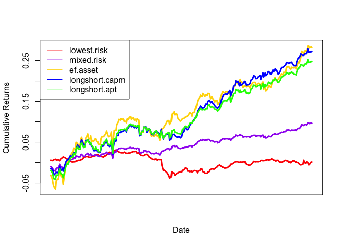

capm\_and\_apt
================

### Read in portfolio asset and macroeconomic data:

``` r
econ = c('CHNGDP','USGDP','EZGDP','US_UNEMP')

shock = c('CHNGDP_Shock','USGDP_Shock','EZGDP_Shock','US_UNEMP_Shock')

finstruments = c('UST_10YR','USFFR','USDRMB','CRUDOIL','CFE_VIX','USDEUR','UST_2YR',
             'SP500_GSCI','USDOIS','UIVE_SP500VALUEETF','USDJPY','USDGBP')

assets = c('VNQ_VANGREALEST','EMB_USDEMRGBOND','LQD_CORPBOND',
            'MUB_MUNIBOND','SHY_1-3USTR','VIG_VANGDIV','IVV_SP500','EEM_MSCIEMERGING',
            'XLE_ENERGYSPDR','EFA_MSCIEAFE','TIP_TIPSBOND')

dataPath = "/Users/chrisolen/Documents/uchicago_courses/deep_learning_and_image_recognition/finance/fin-portfolio-mvo/data"
dat = read.csv(paste(dataPath,"data_cleaned.csv",sep="/"), header=TRUE)
head(dat)
```

    ##        date UST_10YR UIVE_SP500VALUEETF VNQ_VANGREALEST USFFR
    ## 1  1/8/2008   3.8389              74.28         55.4900  4.27
    ## 2  1/9/2008   3.7899              72.72         56.4700  4.26
    ## 3 1/10/2008   3.8858              72.72         57.3400  4.26
    ## 4 1/11/2008   3.8065              73.57         57.3500  4.23
    ## 5 1/14/2008   3.7893              73.95         57.1101  4.24
    ## 6 1/15/2008   3.6995              73.10         55.9500  4.24
    ##   EMB_USDEMRGBOND LQD_CORPBOND MUB_MUNIBOND SHY_1.3USTR  USDJPY  USDGBP
    ## 1         102.197      106.270       101.85       82.66 0.91798 1.97279
    ## 2         102.120      106.050       102.11       82.62 0.90921 1.95768
    ## 3         102.210      105.738       101.96       82.62 0.91370 1.96169
    ## 4         101.838      106.510       102.09       82.85 0.91882 1.95715
    ## 5         102.190      106.070       102.55       82.88 0.92349 1.95273
    ## 6         102.360      106.640       103.11       82.95 0.93523 1.95762
    ##   VIG_VANGDIV IVV_SP500 USDRMB CRUDOIL CFE_VIX EEM_MSCIEMERGING   USDEUR
    ## 1       53.72    139.21 7.2657   96.34   24.10          48.2000 0.679833
    ## 2       54.18    141.05 7.2646   95.68   25.00          49.7800 0.682151
    ## 3       54.66    142.04 7.2724   93.72   24.42          50.3667 0.675288
    ## 4       53.90    140.32 7.2635   92.70   25.01          48.9500 0.676567
    ## 5       54.23    141.75 7.2525   94.21   24.99          49.6700 0.672744
    ## 6       53.26    138.24 7.2431   91.91   25.04          47.4233 0.676704
    ##   XLE_ENERGYSPDR SP500_GSCI EFA_MSCIEAFE TIP_TIPSBOND UST_2YR USDOIS
    ## 1          75.85    620.906        26.14       107.03  2.7607  4.059
    ## 2          76.85    616.887        26.48       106.95  2.6785  4.055
    ## 3          76.53    607.434        26.28       106.47  2.7103  3.994
    ## 4          75.60    605.848        25.71       107.26  2.5936  3.873
    ## 5          77.10    615.283        25.91       107.71  2.5764  3.859
    ## 6          73.91    604.946        25.08       108.26  2.5305  3.866
    ##    CHNGDP    USGDP EZGDP US_UNEMP CHNGDP_Shock USGDP_Shock EZGDP_Shock
    ## 1 85399.6 15671.38  2616        5            0           0           0
    ## 2 85399.6 15671.38  2616        5            0           0           0
    ## 3 85399.6 15671.38  2616        5            0           0           0
    ## 4 85399.6 15671.38  2616        5            0           0           0
    ## 5 85399.6 15671.38  2616        5            0           0           0
    ## 6 85399.6 15671.38  2616        5            0           0           0
    ##   US_UNEMP_Shock   VNQ_VOL   EMB_VOL   LQD_VOL   MUB_VOL   VIG_VOL
    ## 1              0 2.2447160 0.2735705 0.3422718 0.1632483 0.5882431
    ## 2              0 1.4362277 0.2342430 0.3458034 0.1242176 0.5063793
    ## 3              0 0.8041952 0.2064263 0.3429531 0.1096814 0.3640330
    ## 4              0 0.8482511 0.1629478 0.3199825 0.1052141 0.3943602
    ## 5              0 0.7911624 0.1565631 0.2861971 0.2664958 0.3584969
    ## 6              5 0.6148116 0.1919239 0.3682836 0.4727367 0.5167011
    ##    IVV_VOL   EEM_VOL   EFA_VOL   XLE_VOL    SHY_VOL    TIP_VOL
    ## 1 2.430027 0.6720562 0.3750067 1.8485183 0.12223339 0.15833509
    ## 2 1.997616 0.7895796 0.3016952 1.7215894 0.07368853 0.03464102
    ## 3 1.117511 0.9867245 0.1288410 0.6377539 0.04449719 0.22821043
    ## 4 1.159634 0.8867787 0.2902068 0.6711408 0.11584472 0.28778464
    ## 5 1.143866 0.8357762 0.3027045 0.6424407 0.12837445 0.45296799
    ## 6 1.517778 1.1325228 0.5452247 1.2982180 0.15404545 0.68887590

### Extract just the portfolio assets, risk free rate, and market indicator:

``` r
cols.use <- names(dat)[names(dat) %in% assets]
risk.free.rate <- "USFFR"
market.indicator <- "UIVE_SP500VALUEETF"
var.explained = 0.9
full.history <- dat[,c("date",risk.free.rate,market.indicator,cols.use)]
full.history[,"date"] = as.Date(full.history[,"date"], format = "%m/%d/%Y")
head(full.history)
```

    ##         date USFFR UIVE_SP500VALUEETF VNQ_VANGREALEST EMB_USDEMRGBOND
    ## 1 2008-01-08  4.27              74.28         55.4900         102.197
    ## 2 2008-01-09  4.26              72.72         56.4700         102.120
    ## 3 2008-01-10  4.26              72.72         57.3400         102.210
    ## 4 2008-01-11  4.23              73.57         57.3500         101.838
    ## 5 2008-01-14  4.24              73.95         57.1101         102.190
    ## 6 2008-01-15  4.24              73.10         55.9500         102.360
    ##   LQD_CORPBOND MUB_MUNIBOND VIG_VANGDIV IVV_SP500 EEM_MSCIEMERGING
    ## 1      106.270       101.85       53.72    139.21          48.2000
    ## 2      106.050       102.11       54.18    141.05          49.7800
    ## 3      105.738       101.96       54.66    142.04          50.3667
    ## 4      106.510       102.09       53.90    140.32          48.9500
    ## 5      106.070       102.55       54.23    141.75          49.6700
    ## 6      106.640       103.11       53.26    138.24          47.4233
    ##   XLE_ENERGYSPDR EFA_MSCIEAFE TIP_TIPSBOND
    ## 1          75.85        26.14       107.03
    ## 2          76.85        26.48       106.95
    ## 3          76.53        26.28       106.47
    ## 4          75.60        25.71       107.26
    ## 5          77.10        25.91       107.71
    ## 6          73.91        25.08       108.26

``` r
cat("portfolio dimensions:", dim(full.history))
```

    ## portfolio dimensions: 2959 13

### Determine Year(s) of Analysis

``` r
year <- c(2016,2017)
portfolio <- subset(full.history, format(as.Date(date),"%Y")==year)
```

    ## Warning in format(as.Date(date), "%Y") == year: longer object length is not
    ## a multiple of shorter object length

``` r
head(portfolio)
```

    ##            date USFFR UIVE_SP500VALUEETF VNQ_VANGREALEST EMB_USDEMRGBOND
    ## 2013 2016-01-05  0.36              87.68           80.29          105.95
    ## 2015 2016-01-07  0.36              84.98           78.51          105.44
    ## 2017 2016-01-11  0.36              83.79           77.90          105.17
    ## 2019 2016-01-13  0.36              84.21           76.27          104.27
    ## 2021 2016-01-15  0.36              81.12           75.57          103.36
    ## 2023 2016-01-20  0.37              80.02           73.93          103.11
    ##      LQD_CORPBOND MUB_MUNIBOND VIG_VANGDIV IVV_SP500 EEM_MSCIEMERGING
    ## 2013       114.01       110.60       76.97    202.42           31.380
    ## 2015       114.55       111.25       74.64    194.99           29.830
    ## 2017       114.27       111.12       74.03    193.03           29.500
    ## 2019       114.88       111.21       73.25    189.79           29.250
    ## 2021       114.14       111.35       72.62    188.74           28.455
    ## 2023       113.80       111.51       72.10    186.65           28.250
    ##      XLE_ENERGYSPDR EFA_MSCIEAFE TIP_TIPSBOND
    ## 2013          60.53        22.43       110.04
    ## 2015          56.78        21.42       110.30
    ## 2017          54.85        21.34       109.81
    ## 2019          53.66        21.10       110.34
    ## 2021          54.35        20.59       110.24
    ## 2023          51.77        20.34       110.19

# EF/Capital Asset Pricing Model Approach

### N-Year Mean vs. Variance

``` r
mean.sd.portfolio <- cbind(sd=apply(portfolio[,-c(1,2)],2,function(z) sd(diff(log(z)),na.rm=TRUE)), mean=apply(portfolio[,-c(1,2)],2,function(z) mean(diff(log(z)),na.rm=TRUE)))
mean.sd.portfolio
```

    ##                             sd         mean
    ## UIVE_SP500VALUEETF 0.009726439 1.073349e-03
    ## VNQ_VANGREALEST    0.013745247 1.312930e-04
    ## EMB_USDEMRGBOND    0.006181759 3.644805e-04
    ## LQD_CORPBOND       0.004138754 2.554654e-04
    ## MUB_MUNIBOND       0.002691044 5.039930e-06
    ## VIG_VANGDIV        0.008298197 1.122913e-03
    ## IVV_SP500          0.009169973 1.130714e-03
    ## EEM_MSCIEMERGING   0.016704561 1.619629e-03
    ## XLE_ENERGYSPDR     0.017162894 7.057036e-04
    ## EFA_MSCIEAFE       0.013239369 6.658274e-04
    ## TIP_TIPSBOND       0.003841642 1.436495e-04

``` r
mean.riskfree <- mean(portfolio[,2])/100/250
mean.riskfree
```

    ## [1] 2.804921e-05

``` r
plot(mean.sd.portfolio[-1,],ylab="Mean",xlab="Sd",pch=19,xlim=c(0,.04),ylim=c(-.0040,.004)) 
points(0,mean.riskfree,col='green',pch=19) 
points(mean.sd.portfolio[1,1],mean.sd.portfolio[1,2],col='red',pch=19) 
text(mean.sd.portfolio[2,1],mean.sd.portfolio[2,2],labels=substring(rownames(mean.sd.portfolio)[2], 1,3),cex=.8,col="blue",pos=2)
text(mean.sd.portfolio[3,1],mean.sd.portfolio[3,2]*-5,labels=substring(rownames(mean.sd.portfolio)[3], 1,3),cex=.8,col="green",pos=2)
text(mean.sd.portfolio[4,1],mean.sd.portfolio[4,2]*5,labels=substring(rownames(mean.sd.portfolio)[4], 1,3),cex=.8,col="blue",pos=2)
text(mean.sd.portfolio[5,1],mean.sd.portfolio[5,2],labels=substring(rownames(mean.sd.portfolio)[5], 1,3),cex=.8,col="blue",pos=2)
text(mean.sd.portfolio[6,1],mean.sd.portfolio[6,2],labels=substring(rownames(mean.sd.portfolio)[6], 1,3),cex=.8,col="blue",pos=2)
text(mean.sd.portfolio[7,1],mean.sd.portfolio[7,2]*-1.5,labels=substring(rownames(mean.sd.portfolio)[7], 1,3),cex=.8,col="blue",pos=2)
text(mean.sd.portfolio[8,1],mean.sd.portfolio[8,2]*6,labels=substring(rownames(mean.sd.portfolio)[8], 1,3),cex=.8,col="blue",pos=2)
text(mean.sd.portfolio[9,1],mean.sd.portfolio[9,2]*6,labels=substring(rownames(mean.sd.portfolio)[9], 1,3),cex=.8,col="blue",pos=2)
text(mean.sd.portfolio[10,1],mean.sd.portfolio[10,2]*6,labels=substring(rownames(mean.sd.portfolio)[10], 1,3),cex=.8,col="blue",pos=2)
text(mean.sd.portfolio[11,1],mean.sd.portfolio[11,2]*6,labels=substring(rownames(mean.sd.portfolio)[11], 1,3),cex=.8,col="blue",pos=2)
```

<!-- -->

``` r
plot(mean.sd.portfolio[-1,],ylab="Mean",xlab="Sd",pch=19,xlim=c(0,.04),ylim=c(-.0040,.004)) 
points(0,mean.riskfree,col='green',pch=19) 
points(mean.sd.portfolio[1,1],mean.sd.portfolio[1,2],col='red',pch=19) 
lines(c(0,3*mean.sd.portfolio[1,1]),c(mean.riskfree,3*mean.sd.portfolio[1,2]),col='red') 
text(mean.sd.portfolio[1,1],mean.sd.portfolio[1,2],labels="market",cex=.8,col="red",pos=2)
text(.0025,mean.riskfree*5,labels="riskfree",cex=.8,col="green",pos=2)
```

<!-- -->

### Pull out highest n-year return given level of risk

``` r
# ef: efficient frontier
bool.ef.asset <- unname(mean.sd.portfolio[,2]/mean.sd.portfolio[,1] == max(mean.sd.portfolio[,2]/mean.sd.portfolio[,1])) 
ratios <- mean.sd.portfolio[,2]/mean.sd.portfolio[,1]
top.ratio <- ratios[bool.ef.asset] 
plot(mean.sd.portfolio[-1,],ylab="Mean",xlab="Sd",pch=19,xlim=c(0,.04),ylim=c(-.0040,.004)) 
points(mean.sd.portfolio[which(bool.ef.asset == TRUE),1],mean.sd.portfolio[which(bool.ef.asset == TRUE),2],col='yellow', pch=19)
points(0,mean.riskfree,col='green',pch=19)
lines(c(0,3*mean.sd.portfolio[which(bool.ef.asset == TRUE),1]),c(mean.riskfree,3*mean.sd.portfolio[which(bool.ef.asset == TRUE),2]),col='orange') 
text(mean.sd.portfolio[which(bool.ef.asset == TRUE),1],mean.sd.portfolio[which(bool.ef.asset == TRUE),2],labels=rownames(mean.sd.portfolio)[which(bool.ef.asset == TRUE)],cex=.8,col="orange",pos=2)
```

<!-- -->

### Cumulative Returns of High-Yield/Risk Vs. Least Risky

``` r
# pull out index of highest return given level of risk
ef.asset.index <- which(bool.ef.asset == TRUE)
ef.asset <- portfolio[,-c(1:2)][ef.asset.index]

# pull out index of least risky
bool.lowest.risk <- unname(mean.sd.portfolio[,1] == min(mean.sd.portfolio[,1]))
lowest.risk.index <- which(bool.lowest.risk == TRUE)
lowest.risk.asset <- portfolio[,-c(1:2)][lowest.risk.index]

# plot
labDates <- paste(format(portfolio[,1],"%m"),format(portfolio[,1],"%d"),sep="/")
matplot(portfolio$date[-1],cbind(cumsum(diff(log(as.matrix(lowest.risk.asset)))),cumsum(diff(log(as.matrix(ef.asset))))),type="l",lty=1,lwd=3,col=c("red","gold"),ylab="Cumulative Returns",xlab="Date",xaxt="n")
axis.Date(1, at = portfolio$date[-1])
legend("topleft", legend=c(colnames(lowest.risk.asset), colnames(ef.asset)), col=c("red", "yellow"), lty=1:2, cex=0.8)
```

<!-- -->

### Mixing ef.asset with lowest.risk.asset, to provide the same level of risk as lowest.risk.asset with a higher return

``` r
# frontier line is line from riskfree rate to ef.asset
frontier.data <- data.frame(rbind(c(mean.riskfree,0), c(mean(diff(log(as.matrix(ef.asset)))), sd(diff(log(as.matrix(ef.asset))))))) 
colnames(frontier.data) <- c("means","sds") 
rownames(frontier.data) <- c("risk.free","ef.asset")

# regressing means of frontier line on risks of frontier line
frontier.line <- lm(means ~ sds, data = frontier.data) 

# extracting lowest.risk.asset risk

portfolio.required.sd <- mean.sd.portfolio[lowest.risk.index,1]
new <- data.frame(sds = portfolio.required.sd)

# predicting the return on the frontier line given EMB-level risk
portfolio.required.mean <- predict(frontier.line, new)

# looking for the point on the frontier line corresponding to the required return
proportion.risky <- (portfolio.required.mean - frontier.data[1,1])/(-frontier.data[1,1] + frontier.data[2,1])
proportion.riskless <- 1-proportion.risky

# create the new portfolio with a mixture of these two assets according to the aboth
mixRFKR.returns <- (portfolio[-1,2]/100/250)*proportion.riskless + diff(log(as.matrix(ef.asset)))*proportion.risky
matplot(portfolio$date[-1], cbind(cumsum(diff(log(as.matrix(lowest.risk.asset)))), cumsum(mixRFKR.returns), cumsum(diff(log(as.matrix(ef.asset))))),type="l",lty=1,lwd=3,col=c("red","purple","gold"), ylab="Cumulative Returns",xlab="Date",xaxt="n")
legend("topleft",legend=c("lowest.risk","mixed", "ef.asset"),col=c("red","purple","gold"),lty=1)
axis.Date(1, at = portfolio$date[-1])
```

<!-- -->

### Confirming that the risk of the mixed is the same as that of lowest.risk.asset

``` r
 c(LowestRisk=sd(diff(log(as.matrix(lowest.risk.asset)))),RiskMixedPortfolio=sd(mixRFKR.returns))
```

    ##         LowestRisk RiskMixedPortfolio 
    ##        0.002691044        0.002691141

### Capital Asset Pricing Model (CAPM)

``` r
# examining the sensitivity of each individual asset to the market (defined as SP500)
riskfree.daily <- portfolio[,2]/100/365
market <- portfolio[,3]

# we regress the log-difference asset retuns minus the daily FFR against the 'market' returns minus the daily FFR
portfolioBetas <- apply(as.matrix(portfolio[,-c(1,2)]),2,function(z) lm(I(diff(log(z))-riskfree.daily[-length(riskfree.daily)])~-1+I(diff(log(market))-riskfree.daily[-length(riskfree.daily)]))$coefficients)

# betas are estimated as slopes of each excess log returns sample to the SPY excess log returns
plot(1:length(portfolioBetas),portfolioBetas,xlab="Index")
```

<!-- -->

``` r
portfolioBetas
```

    ## UIVE_SP500VALUEETF    VNQ_VANGREALEST    EMB_USDEMRGBOND 
    ##         1.00000000         0.39156315         0.10806971 
    ##       LQD_CORPBOND       MUB_MUNIBOND        VIG_VANGDIV 
    ##        -0.04220855        -0.08772655         0.53717747 
    ##          IVV_SP500   EEM_MSCIEMERGING     XLE_ENERGYSPDR 
    ##         0.64991496         0.83770964         1.01232911 
    ##       EFA_MSCIEAFE       TIP_TIPSBOND 
    ##         0.91571799        -0.05232430

### Plot the Beta-Mean Returns Space

``` r
meanReturns <- mean.sd.portfolio[,2]
portfolioBetas[length(portfolioBetas)+1] <- 0
meanReturns[length(meanReturns)+1] <- 0
plot(portfolioBetas, meanReturns, pch = 19)
points(0,0,col='green',pch = 19) 
points(portfolioBetas[1],meanReturns[1],col='red',pch=19) 
text(portfolioBetas[1],meanReturns[1],labels=colnames(portfolio[3]),cex=.8,col="orange",pos=2) 
lines(c(0,4*portfolioBetas[1]),c(0,4*meanReturns[1]),col='red')
```

<!-- -->

We recall that CAPM states that those assets that land above the line
are undervalued and should be purchased while those below the line are
overvalued and should be shorted. Thus, in the former case, we are
speculating that the value will go up, and in the latter case, we are
speculating that the price will go down.

### Market-Neutral Portfolio Per CAPM

``` r
# SML = Security Market Line
SML <- data.frame(a=mean.riskfree, b=mean.sd.portfolio[1,2]-mean.riskfree) 
x <- portfolioBetas[-c(1,length(portfolioBetas))]
y <- SML$a + SML$b * x
```

``` r
### Long Portfolio ###
# create long portfolio based on SML
longPortfolio <- mean.sd.portfolio[-1,2] > y 
cat("longPortfolio assets:\n",names(mean.sd.portfolio[-1,2][longPortfolio]),"\n")
```

    ## longPortfolio assets:
    ##  EMB_USDEMRGBOND LQD_CORPBOND MUB_MUNIBOND VIG_VANGDIV IVV_SP500 EEM_MSCIEMERGING TIP_TIPSBOND

``` r
# plot long portfolio
plot(portfolioBetas[-c(1,length(portfolioBetas))], mean.sd.portfolio[-1,2],ylab="Mean Returns",xlab="Betas",pch=19,xlim=c(0,2))
points(1,mean.sd.portfolio[1,2],col="red",pch=19)
points(0,mean.riskfree,col="green",pch=19) 
lines(c(0,2),c(mean.riskfree,1.75*mean.sd.portfolio[1,2]),col="red") 
points(portfolioBetas[-c(1,length(portfolioBetas))][longPortfolio],mean.sd.portfolio[-1,2][longPortfolio],col="gold",pch=16)
```

<!-- -->

``` r
# calculate weights of the long portfolio based on the the distance to the SML
# we assume that the further an asset is above the line, the more undervalued it is, so the more of it we want to be long in
d <- mean.sd.portfolio[-1,2][longPortfolio]-(SML$a + (SML$b*portfolioBetas[-c(1,length(portfolioBetas))][longPortfolio]))
longOnlyWeights <- d/sum(d)
cat("longOnlyWeights:\n",head(longOnlyWeights),"\n")
```

    ## longOnlyWeights:
    ##  0.09285658 0.1128313 0.02854319 0.2216233 0.1758971 0.2974862

``` r
# calculate the initial value of the weighted long portfolio
longOnlyValue <- as.matrix(portfolio[1,-c(1:3)])[longPortfolio]%*%longOnlyWeights 
cat("initial value of weighted long portfolio:\n",longOnlyValue)
```

    ## initial value of weighted long portfolio:
    ##  95.64417

We note that assets with negative returns but larger Betas are moving
positively with the market and are thus said to be overvalued.

``` r
### Short Portfolio ###
cat("short portfolio assets:\n",names(!longPortfolio),"\n")
```

    ## short portfolio assets:
    ##  VNQ_VANGREALEST EMB_USDEMRGBOND LQD_CORPBOND MUB_MUNIBOND VIG_VANGDIV IVV_SP500 EEM_MSCIEMERGING XLE_ENERGYSPDR EFA_MSCIEAFE TIP_TIPSBOND

``` r
# calculate weights of the short portfolio based on the the distance to the SML
# we assume that the further an asset is below the line, the more overvalued it is, so the more of it we want to short
d <- (SML$a + (SML$b*portfolioBetas[-c(1,length(portfolioBetas))][!longPortfolio]))-mean.sd.portfolio[-1,2][!longPortfolio]
shortOnlyWeights <- d/sum(d)
cat("short portfolio weights:\n", shortOnlyWeights, "\n")
```

    ## short portfolio weights:
    ##  0.3042282 0.3782589 0.3175128

``` r
# calculate the initial value of the weighted short portfolio
shortOnlyValue <- as.matrix(portfolio[1,-c(1:3)])[!longPortfolio]%*%shortOnlyWeights 
cat("short portfolio initial value:", shortOnlyValue, "\n")
```

    ## short portfolio initial value: 54.44431

``` r
# determine whether long or short portfolio begin at higher value
c(longOnlyValue=longOnlyValue, shortOnlyValue=shortOnlyValue)
```

    ##  longOnlyValue shortOnlyValue 
    ##       95.64417       54.44431

``` r
higher = c(longOnlyValue=longOnlyValue, shortOnlyValue=shortOnlyValue) == max(c(longOnlyValue=longOnlyValue, shortOnlyValue=shortOnlyValue))

if (higher[1]) {
  portfolioProportion <- longOnlyValue/shortOnlyValue
  cat("Long:Short Proportion ", portfolioProportion, "\n")
  c(longOnlyShares=longOnlyValue/shortOnlyValue, shortOnlyShares=1)

  # value trajectory of the long only portfolio, given the weights
  longValueTrajectory <- as.matrix(portfolio[,-(1:3)])[,longPortfolio]%*%longOnlyWeights 
  # value trajectory of the short only portfolio, given the weights
  shortValueTrajectory <- as.matrix(portfolio[,-(1:3)])[,!longPortfolio]%*%shortOnlyWeights 
  totallongshortTrajectory.CAPM <- longValueTrajectory%*%portfolioProportion-shortValueTrajectory

  matplot(portfolio$date, totallongshortTrajectory.CAPM,type="l",xlab="year",xaxt="n",ylab="Value of Market-Neutral Portfolio")
  axis.Date(1, at = portfolio$date)
  
} else {
  
  portfolioProportion <- shortOnlyValue/longOnlyValue
  cat("Short:Long Proportion: ", portfolioProportion, "\n")
  c(shortOnlyShares=shortOnlyValue/longOnlyValue, longOnlyShares=1)

  # value trajectory of the long only portfolio, given the weights
  longValueTrajectory <- as.matrix(portfolio[,-(1:3)])[,longPortfolio]%*%longOnlyWeights 
  # value trajectory of the short only portfolio, given the weights
  shortValueTrajectory <- as.matrix(portfolio[,-(1:3)])[,!longPortfolio]%*%shortOnlyWeights 
  totallongshortTrajectory.CAPM <- longValueTrajectory%*%portfolioProportion-shortValueTrajectory

  matplot(portfolio$date, totallongshortTrajectory.CAPM,type="l",xlab="year",xaxt="n",ylab="Value of Market-Neutral Portfolio")
  axis.Date(1, at = portfolio$date)

}
```

    ## Long:Short Proportion  1.756734

<!-- -->

# Arbitrage Pricing Theory Approach

### Convert to log returns:

``` r
portfolio.returns <- apply(log(portfolio[,-(1:3)]),2,diff)
head(portfolio.returns)
```

    ##      VNQ_VANGREALEST EMB_USDEMRGBOND LQD_CORPBOND  MUB_MUNIBOND
    ## 2015    -0.022419075    -0.004825214  0.004725245  0.0058598320
    ## 2017    -0.007800052    -0.002563982 -0.002447340 -0.0011692226
    ## 2019    -0.021146277    -0.008594400  0.005324036  0.0008096074
    ## 2021    -0.009220297    -0.008765649 -0.006462340  0.0012580879
    ## 2023    -0.021940679    -0.002421661 -0.002983243  0.0014358793
    ## 2025     0.032994878     0.013869046 -0.002287324 -0.0018850147
    ##       VIG_VANGDIV    IVV_SP500 EEM_MSCIEMERGING XLE_ENERGYSPDR
    ## 2015 -0.030739179 -0.037396472     -0.050656149    -0.06395496
    ## 2017 -0.008206140 -0.010102658     -0.011124335    -0.03458196
    ## 2019 -0.010592169 -0.016927419     -0.008510690    -0.02193434
    ## 2021 -0.008637882 -0.005547791     -0.027555682     0.01277677
    ## 2023 -0.007186322 -0.011135201     -0.007230434    -0.04863378
    ## 2025  0.020862684  0.025600383      0.037517425     0.07388719
    ##      EFA_MSCIEAFE  TIP_TIPSBOND
    ## 2015 -0.046074284  0.0023599902
    ## 2017 -0.003741819 -0.0044523266
    ## 2019 -0.011310205  0.0048149082
    ## 2021 -0.024467519 -0.0009067006
    ## 2023 -0.012216130 -0.0004536588
    ## 2025  0.045178274 -0.0021804315

### Select PCA factors:

``` r
n.assets <- dim(portfolio.returns)[2]
portfolio.returns.PCA <- prcomp(portfolio.returns)
summary(portfolio.returns.PCA)$importance[,1:n.assets]
```

    ##                               PC1      PC2        PC3         PC4
    ## Standard deviation     0.02679256 0.013483 0.01043806 0.009572059
    ## Proportion of Variance 0.61453000 0.155630 0.09327000 0.078440000
    ## Cumulative Proportion  0.61453000 0.770160 0.86343000 0.941870000
    ##                                PC5         PC6         PC7        PC8
    ## Standard deviation     0.005169502 0.004627567 0.002898062 0.00212077
    ## Proportion of Variance 0.022880000 0.018330000 0.007190000 0.00385000
    ## Cumulative Proportion  0.964750000 0.983080000 0.990270000 0.99412000
    ##                                PC9        PC10
    ## Standard deviation     0.001885611 0.001819771
    ## Proportion of Variance 0.003040000 0.002830000
    ## Cumulative Proportion  0.997170000 1.000000000

``` r
# select number of factors based on accounting for at least var.explained percentage of the variance
prop.var <- summary(portfolio.returns.PCA)$importance[2,1:n.assets]
nFactors <- n.assets - sum(cumsum(prop.var) > var.explained) + 1 
cat("number of factors to be used: ",nFactors)
```

    ## number of factors to be used:  4

``` r
# generate factors loadings
factorLoadings <- portfolio.returns.PCA$rotation[,1:nFactors] 
# generate factor scores
factorScores <- portfolio.returns%*%factorLoadings 
# generate zero loading
zeroLoading <- portfolio.returns.PCA$center

# generate approximation of original returns after dim reduction
nFactorAppr <- factorScores%*%t(factorLoadings)

# we want to get a good idea of how well the factor approximations are at predicting the real thing
r.squareds <- mapply(col.ind = 1:ncol(nFactorAppr), function(col.ind){summary(lm(portfolio.returns[,col.ind]~nFactorAppr[,col.ind]))$r.squared})

# get a density plot of all of the r-squared's
plot(density(r.squareds), main = "Distribution of Determination Coefficients") 
# how well factors actually do predict the original assets
abline(v=mean(r.squareds), col = "green") 
# expected amount of variance explained given the number of factors we chose in PCA
abline(v=summary(portfolio.returns.PCA)$importance[3,nFactors],lwd=2,col="red") 
legend("topleft",legend=c("mean r-squared","expected for nFactors"),col=c("green","red" ),lty=1, cex = 0.6)
```

<!-- -->

### Use the nFactors PCA components as market factors for APT mode:

``` r
portfolio.returns.betas <- factorLoadings 

color = grDevices::colors()[grep('gr(a|e)y', grDevices::colors(), invert = T)]
col=sample(color, n.assets)
matplot(1:nFactors,t(portfolio.returns.betas),type="l",lty=1,xlab="MarketFactors",ylab="Betas",lwd=2, col=col)
legend("bottomleft",legend=rownames(portfolio.returns.betas),lty=1,lwd=2,col=col, cex = .4)
```

<!-- -->

The first market factor varies positively with all of the portfolio
assets. The second effect has opposite effects on the real estate index
than it does on the energy index.

### Estimation of market prices of risk

``` r
# alpha: mean log return for each asset [1, n.assets]
# portfolio.returns.betas: factor loadings for each asset [n.assets, nFactors]
alpha <- zeroLoading
# regressing the average return for each asset on the market risk factors for each asset
mpor.fit <- lm(I(alpha-mean.riskfree)~.-1, data = data.frame(portfolio.returns.betas)) 

# note insignificant factors, if any
summary(mpor.fit)
```

    ## 
    ## Call:
    ## lm(formula = I(alpha - mean.riskfree) ~ . - 1, data = data.frame(portfolio.returns.betas))
    ## 
    ## Residuals:
    ##        Min         1Q     Median         3Q        Max 
    ## -4.265e-04 -3.880e-05  1.325e-05  1.911e-04  5.448e-04 
    ## 
    ## Coefficients:
    ##      Estimate Std. Error t value Pr(>|t|)    
    ## PC1 0.0021746  0.0003518   6.181 0.000825 ***
    ## PC2 0.0001312  0.0003518   0.373 0.721994    
    ## PC3 0.0006995  0.0003518   1.988 0.093934 .  
    ## PC4 0.0001588  0.0003518   0.451 0.667567    
    ## ---
    ## Signif. codes:  0 '***' 0.001 '**' 0.01 '*' 0.05 '.' 0.1 ' ' 1
    ## 
    ## Residual standard error: 0.0003518 on 6 degrees of freedom
    ## Multiple R-squared:  0.8763, Adjusted R-squared:  0.7938 
    ## F-statistic: 10.62 on 4 and 6 DF,  p-value: 0.006871

``` r
print("Market Prices of Risk: ", mpor.fit$coefficients)
```

    ## [1] "Market Prices of Risk: "

``` r
print("R-Squared: ",  summary(mpor.fit)$r.squared)
```

    ## [1] "R-Squared: "

``` r
# analysis of residuals
modelResiduals <- as.vector(summary(mpor.fit)$residuals) 
hist(modelResiduals)
```

<!-- -->

``` r
qqnorm(modelResiduals)
qqline(modelResiduals)
```

<!-- -->

### Use the residuals of the equilibrium model to assess the price of each stock relative to the prediction for the time period

``` r
plot(modelResiduals,type="h",xlab="Stock",ylab="Residual") 
abline(h=0)
```

<!-- -->

### Create a list of assets recommended for long and short portfolios based on the above:

``` r
### Long Portfolio ###
longPortfolio.APT <- colnames(portfolio.returns)[modelResiduals > 0] 
dL <- modelResiduals[modelResiduals > 0] 
longPortfolioWeights <- dL/sum(dL) 

# initial avlue of long portfolio
longOnlyValue <- as.matrix(portfolio[1,-(1:3)][longPortfolio.APT])%*%longPortfolioWeights

### Short Portfolio ###
shortPortfolio.APT <- colnames(portfolio.returns)[modelResiduals < 0] 
dS <- modelResiduals[modelResiduals < 0] 
shortPortfolioWeights <- dS/sum(dS)

# initial value of short portfolio
shortOnlyValue <- as.matrix(portfolio[1,-(1:3)][shortPortfolio.APT])%*%shortPortfolioWeights
```

``` r
# determine whether long or short portfolio begin at higher value
c(longOnlyValue=longOnlyValue, shortOnlyValue=shortOnlyValue)
```

    ##  longOnlyValue shortOnlyValue 
    ##      125.36223       41.46496

``` r
higher = c(longOnlyValue=longOnlyValue, shortOnlyValue=shortOnlyValue) == max(c(longOnlyValue=longOnlyValue, shortOnlyValue=shortOnlyValue))

if (higher[1]) {
  portfolioProportion <- longOnlyValue/shortOnlyValue
  cat("Long:Short Proportion ", portfolioProportion, "\n")
  c(longOnlyShares=longOnlyValue/shortOnlyValue, shortOnlyShares=1)

  # value trajectory of the long only portfolio, given the weights
  longValueTrajectory <- as.matrix(portfolio[,-(1:3)])[,longPortfolio]%*%longOnlyWeights 
  # value trajectory of the short only portfolio, given the weights
  shortValueTrajectory <- as.matrix(portfolio[,-(1:3)])[,!longPortfolio]%*%shortOnlyWeights 
  totallongshortTrajectory.APT <- longValueTrajectory%*%portfolioProportion-shortValueTrajectory

  matplot(portfolio$date, totallongshortTrajectory.APT,type="l",xlab="year",xaxt="n",ylab="Value of Market-Neutral Portfolio")
  axis.Date(1, at = portfolio$date)
  
} else {
  
  portfolioProportion <- shortOnlyValue/longOnlyValue
  cat("Short:Long Proportion: ", portfolioProportion, "\n")
  c(shortOnlyShares=shortOnlyValue/longOnlyValue, longOnlyShares=1)

  # value trajectory of the long only portfolio, given the weights
  longValueTrajectory <- as.matrix(portfolio[,-(1:3)])[,longPortfolio]%*%longOnlyWeights 
  # value trajectory of the short only portfolio, given the weights
  shortValueTrajectory <- as.matrix(portfolio[,-(1:3)])[,!longPortfolio]%*%shortOnlyWeights 
  totallongshortTrajectory.APT <- longValueTrajectory%*%portfolioProportion-shortValueTrajectory

  matplot(portfolio$date, totallongshortTrajectory.APT,type="l",xlab="year",xaxt="n",ylab="Value of Market-Neutral Portfolio")
  axis.Date(1, at = portfolio$date)

}
```

    ## Long:Short Proportion  3.02333

<!-- -->

### lowest.risk.asset vs. ef.asset vs. mixed.risk vs. longshort (CAPM) vs. longshort (APM)

``` r
matplot(portfolio$date[-1], cbind(cumsum(diff(log(as.matrix(lowest.risk.asset)))), cumsum(mixRFKR.returns), cumsum(diff(log(as.matrix(ef.asset)))), cumsum(diff(log(totallongshortTrajectory.CAPM))), cumsum(diff(log(totallongshortTrajectory.APT)))),type="l",lty=1,lwd=3,col=c("red","purple","gold", "blue","green"), ylab="Cumulative Returns",xlab="Date",xaxt="n")
legend("topleft",legend=c("lowest.risk","mixed.risk", "ef.asset", "longshort.capm", "longshort.apt"),col=c("red","purple","gold", "blue","green"),lty=1)
```

<!-- -->
