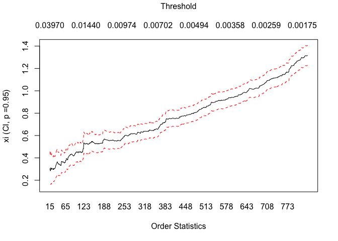
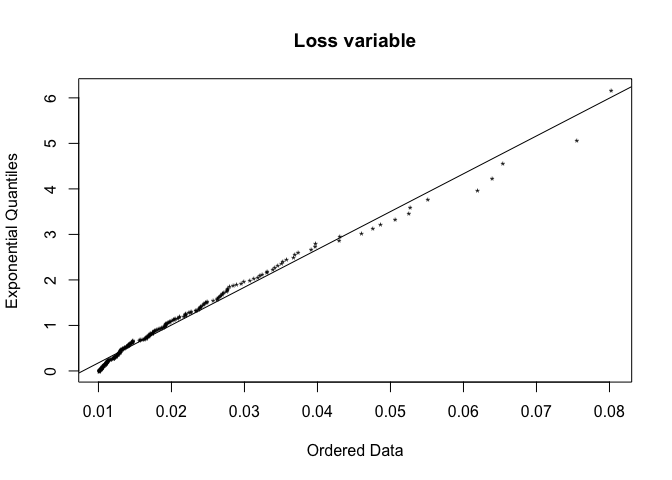
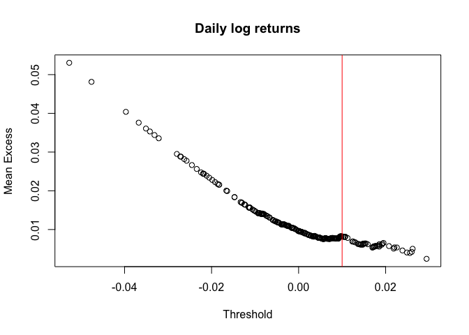
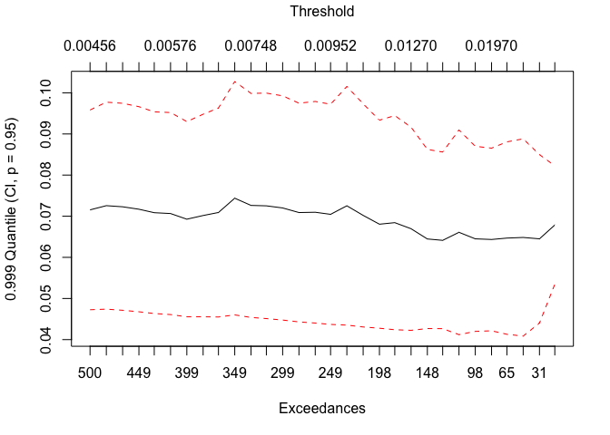

evt\_var
================

``` r
riskScripts <- "/Users/chrisolen/Documents/uchicago_courses/deep_learning_and_image_recognition/finance/fin-portfolio-mvo/risk_scripts"
source(paste(riskScripts,"RMfit.R",sep="/"))
source(paste(riskScripts,"RMeasure.R",sep="/"))
source(paste(riskScripts,"Hill.R",sep="/"))
source(paste(riskScripts,"SimGarcht.R",sep="/"))
library(fGarch)
```

    ## Loading required package: timeDate

    ## Loading required package: timeSeries

    ## Loading required package: fBasics

``` r
library(ellipse)
```

    ## 
    ## Attaching package: 'ellipse'

    ## The following object is masked from 'package:graphics':
    ## 
    ##     pairs

``` r
library(evir) 
```

### Read in portfolio asset and macroeconomic data:

``` r
econ = c('CHNGDP','USGDP','EZGDP','US_UNEMP')

shock = c('CHNGDP_Shock','USGDP_Shock','EZGDP_Shock','US_UNEMP_Shock')

finstruments = c('UST_10YR','USFFR','USDRMB','CRUDOIL','CFE_VIX','USDEUR','UST_2YR',
             'SP500_GSCI','USDOIS','UIVE_SP500VALUEETF','USDJPY','USDGBP')

assets = c('VNQ_VANGREALEST','EMB_USDEMRGBOND','LQD_CORPBOND',
            'MUB_MUNIBOND','SHY_1-3USTR','VIG_VANGDIV','IVV_SP500','EEM_MSCIEMERGING',
            'XLE_ENERGYSPDR','EFA_MSCIEAFE','TIP_TIPSBOND')

dataPath = "/Users/chrisolen/Documents/uchicago_courses/deep_learning_and_image_recognition/finance/fin-portfolio-mvo/data"
dat = read.csv(paste(dataPath,"data_cleaned.csv",sep="/"), header=TRUE)
head(dat)
```

    ##        date UST_10YR UIVE_SP500VALUEETF VNQ_VANGREALEST USFFR
    ## 1  1/8/2008   3.8389              74.28         55.4900  4.27
    ## 2  1/9/2008   3.7899              72.72         56.4700  4.26
    ## 3 1/10/2008   3.8858              72.72         57.3400  4.26
    ## 4 1/11/2008   3.8065              73.57         57.3500  4.23
    ## 5 1/14/2008   3.7893              73.95         57.1101  4.24
    ## 6 1/15/2008   3.6995              73.10         55.9500  4.24
    ##   EMB_USDEMRGBOND LQD_CORPBOND MUB_MUNIBOND SHY_1.3USTR  USDJPY  USDGBP
    ## 1         102.197      106.270       101.85       82.66 0.91798 1.97279
    ## 2         102.120      106.050       102.11       82.62 0.90921 1.95768
    ## 3         102.210      105.738       101.96       82.62 0.91370 1.96169
    ## 4         101.838      106.510       102.09       82.85 0.91882 1.95715
    ## 5         102.190      106.070       102.55       82.88 0.92349 1.95273
    ## 6         102.360      106.640       103.11       82.95 0.93523 1.95762
    ##   VIG_VANGDIV IVV_SP500 USDRMB CRUDOIL CFE_VIX EEM_MSCIEMERGING   USDEUR
    ## 1       53.72    139.21 7.2657   96.34   24.10          48.2000 0.679833
    ## 2       54.18    141.05 7.2646   95.68   25.00          49.7800 0.682151
    ## 3       54.66    142.04 7.2724   93.72   24.42          50.3667 0.675288
    ## 4       53.90    140.32 7.2635   92.70   25.01          48.9500 0.676567
    ## 5       54.23    141.75 7.2525   94.21   24.99          49.6700 0.672744
    ## 6       53.26    138.24 7.2431   91.91   25.04          47.4233 0.676704
    ##   XLE_ENERGYSPDR SP500_GSCI EFA_MSCIEAFE TIP_TIPSBOND UST_2YR USDOIS
    ## 1          75.85    620.906        26.14       107.03  2.7607  4.059
    ## 2          76.85    616.887        26.48       106.95  2.6785  4.055
    ## 3          76.53    607.434        26.28       106.47  2.7103  3.994
    ## 4          75.60    605.848        25.71       107.26  2.5936  3.873
    ## 5          77.10    615.283        25.91       107.71  2.5764  3.859
    ## 6          73.91    604.946        25.08       108.26  2.5305  3.866
    ##    CHNGDP    USGDP EZGDP US_UNEMP CHNGDP_Shock USGDP_Shock EZGDP_Shock
    ## 1 85399.6 15671.38  2616        5            0           0           0
    ## 2 85399.6 15671.38  2616        5            0           0           0
    ## 3 85399.6 15671.38  2616        5            0           0           0
    ## 4 85399.6 15671.38  2616        5            0           0           0
    ## 5 85399.6 15671.38  2616        5            0           0           0
    ## 6 85399.6 15671.38  2616        5            0           0           0
    ##   US_UNEMP_Shock   VNQ_VOL   EMB_VOL   LQD_VOL   MUB_VOL   VIG_VOL
    ## 1              0 2.2447160 0.2735705 0.3422718 0.1632483 0.5882431
    ## 2              0 1.4362277 0.2342430 0.3458034 0.1242176 0.5063793
    ## 3              0 0.8041952 0.2064263 0.3429531 0.1096814 0.3640330
    ## 4              0 0.8482511 0.1629478 0.3199825 0.1052141 0.3943602
    ## 5              0 0.7911624 0.1565631 0.2861971 0.2664958 0.3584969
    ## 6              5 0.6148116 0.1919239 0.3682836 0.4727367 0.5167011
    ##    IVV_VOL   EEM_VOL   EFA_VOL   XLE_VOL    SHY_VOL    TIP_VOL
    ## 1 2.430027 0.6720562 0.3750067 1.8485183 0.12223339 0.15833509
    ## 2 1.997616 0.7895796 0.3016952 1.7215894 0.07368853 0.03464102
    ## 3 1.117511 0.9867245 0.1288410 0.6377539 0.04449719 0.22821043
    ## 4 1.159634 0.8867787 0.2902068 0.6711408 0.11584472 0.28778464
    ## 5 1.143866 0.8357762 0.3027045 0.6424407 0.12837445 0.45296799
    ## 6 1.517778 1.1325228 0.5452247 1.2982180 0.15404545 0.68887590

### Extract just the portfolio assets, risk free rate, and market indicator:

``` r
cols.use <- names(dat)[names(dat) %in% assets]
risk.free.rate <- "USFFR"
market.indicator <- "UIVE_SP500VALUEETF"
var.explained = 0.8
nDay.forecastHorizon <- 10
full.history <- dat[,c("date",risk.free.rate,market.indicator,cols.use)]
full.history[,"date"] = as.Date(full.history[,"date"], format = "%m/%d/%Y")
head(full.history)
```

    ##         date USFFR UIVE_SP500VALUEETF VNQ_VANGREALEST EMB_USDEMRGBOND
    ## 1 2008-01-08  4.27              74.28         55.4900         102.197
    ## 2 2008-01-09  4.26              72.72         56.4700         102.120
    ## 3 2008-01-10  4.26              72.72         57.3400         102.210
    ## 4 2008-01-11  4.23              73.57         57.3500         101.838
    ## 5 2008-01-14  4.24              73.95         57.1101         102.190
    ## 6 2008-01-15  4.24              73.10         55.9500         102.360
    ##   LQD_CORPBOND MUB_MUNIBOND VIG_VANGDIV IVV_SP500 EEM_MSCIEMERGING
    ## 1      106.270       101.85       53.72    139.21          48.2000
    ## 2      106.050       102.11       54.18    141.05          49.7800
    ## 3      105.738       101.96       54.66    142.04          50.3667
    ## 4      106.510       102.09       53.90    140.32          48.9500
    ## 5      106.070       102.55       54.23    141.75          49.6700
    ## 6      106.640       103.11       53.26    138.24          47.4233
    ##   XLE_ENERGYSPDR EFA_MSCIEAFE TIP_TIPSBOND
    ## 1          75.85        26.14       107.03
    ## 2          76.85        26.48       106.95
    ## 3          76.53        26.28       106.47
    ## 4          75.60        25.71       107.26
    ## 5          77.10        25.91       107.71
    ## 6          73.91        25.08       108.26

``` r
cat("portfolio dimensions:", dim(full.history))
```

    ## portfolio dimensions: 2959 13

### Determine Year(s) of Analysis

``` r
year <- c(2016,2017)
portfolio <- subset(full.history, format(as.Date(date),"%Y")==year)
```

    ## Warning in format(as.Date(date), "%Y") == year: longer object length is not
    ## a multiple of shorter object length

``` r
head(portfolio)
```

    ##            date USFFR UIVE_SP500VALUEETF VNQ_VANGREALEST EMB_USDEMRGBOND
    ## 2013 2016-01-05  0.36              87.68           80.29          105.95
    ## 2015 2016-01-07  0.36              84.98           78.51          105.44
    ## 2017 2016-01-11  0.36              83.79           77.90          105.17
    ## 2019 2016-01-13  0.36              84.21           76.27          104.27
    ## 2021 2016-01-15  0.36              81.12           75.57          103.36
    ## 2023 2016-01-20  0.37              80.02           73.93          103.11
    ##      LQD_CORPBOND MUB_MUNIBOND VIG_VANGDIV IVV_SP500 EEM_MSCIEMERGING
    ## 2013       114.01       110.60       76.97    202.42           31.380
    ## 2015       114.55       111.25       74.64    194.99           29.830
    ## 2017       114.27       111.12       74.03    193.03           29.500
    ## 2019       114.88       111.21       73.25    189.79           29.250
    ## 2021       114.14       111.35       72.62    188.74           28.455
    ## 2023       113.80       111.51       72.10    186.65           28.250
    ##      XLE_ENERGYSPDR EFA_MSCIEAFE TIP_TIPSBOND
    ## 2013          60.53        22.43       110.04
    ## 2015          56.78        21.42       110.30
    ## 2017          54.85        21.34       109.81
    ## 2019          53.66        21.10       110.34
    ## 2021          54.35        20.59       110.24
    ## 2023          51.77        20.34       110.19

### Convert to log returns:

``` r
portfolio.returns <- apply(log(portfolio[,-(1:3)]),2,diff)
head(portfolio.returns)
```

    ##      VNQ_VANGREALEST EMB_USDEMRGBOND LQD_CORPBOND  MUB_MUNIBOND
    ## 2015    -0.022419075    -0.004825214  0.004725245  0.0058598320
    ## 2017    -0.007800052    -0.002563982 -0.002447340 -0.0011692226
    ## 2019    -0.021146277    -0.008594400  0.005324036  0.0008096074
    ## 2021    -0.009220297    -0.008765649 -0.006462340  0.0012580879
    ## 2023    -0.021940679    -0.002421661 -0.002983243  0.0014358793
    ## 2025     0.032994878     0.013869046 -0.002287324 -0.0018850147
    ##       VIG_VANGDIV    IVV_SP500 EEM_MSCIEMERGING XLE_ENERGYSPDR
    ## 2015 -0.030739179 -0.037396472     -0.050656149    -0.06395496
    ## 2017 -0.008206140 -0.010102658     -0.011124335    -0.03458196
    ## 2019 -0.010592169 -0.016927419     -0.008510690    -0.02193434
    ## 2021 -0.008637882 -0.005547791     -0.027555682     0.01277677
    ## 2023 -0.007186322 -0.011135201     -0.007230434    -0.04863378
    ## 2025  0.020862684  0.025600383      0.037517425     0.07388719
    ##      EFA_MSCIEAFE  TIP_TIPSBOND
    ## 2015 -0.046074284  0.0023599902
    ## 2017 -0.003741819 -0.0044523266
    ## 2019 -0.011310205  0.0048149082
    ## 2021 -0.024467519 -0.0009067006
    ## 2023 -0.012216130 -0.0004536588
    ## 2025  0.045178274 -0.0021804315

### Hill and Pickands Estimations

``` r
# we use the non-parametric Hill and Pickands approach to estimate the value of shape parameter of Frechet distribution, ξ. for a generalized Pareto analysis of heavy-tailed data using the gpd function (below), it helps to plot the Hill estimates for xi. 

# create loss variable (xt = -rt)
xt <- -portfolio.returns
hill(xt,option=c("xi"),end=length(xt)/3)
```

<!-- -->

``` r
# estimation for xi is fairly stable between order statistics 180 and 366. We note that the xi is significantly different from zero, indicating a Frechet distribution. 
```

``` r
# plot exponential quantiles versus order statistic quantiles to confirm the necessity of the shape parameter xi. we note that an exponential distribution has a fatter tail than a GPD with shape param xi. 

qplot(xt,threshold=0.01,pch='*',cex=0.8,main="Loss variable")
```

<!-- -->

### Mean Excess Plot

``` r
# Mean excess loss of realizations of loss random variable that exceed a certain threshold of loss
# Straight line with positive gradient above some threshold is a sign of Pareto behavior in the tail
# A downward trend shows thin-tailed behavior
# A line with zero gradient shows an exponential tail

meplot(portfolio.returns[,1])
abline(v=.01,col="red") 
title(main="Daily log returns")
```

<!-- -->

### Peaks Over Threshold

The weaknesses of traditional EVT include: 1. The choice of subperiod
length \(n\) is not clearly defined 2. By using only subperiod maxima,
the approach does not make efficient use of the loss data 3. The
approach is unconditional and, hence, does not take into consideration
the effects of other explanatory variables. POT looks at exceedances of
the loss over some high threshold and the times at which the exceedances
occur. As a result, POT does not require the choice of block size, but
it requires the choice of the threshold level. The rule of thumb is to
choose a threshold that gets exceeded at least 5% of the time by the
sample. We define the following

•\(x_{t}\) •\(η\) •\(t_{i}\)

Instead of using the marginal distribution as for EVT (e.g. the limiting
distribution of the minimum or maximum), the POT approach employes a
conditional distribution to handle the magnitude of exceedance given
that the measurement exceed a threshold. The chance of exceeding the
threshold is governed by a probability law. In other words, the POC
approach considers the conditional distribution of
\(y=x_{t}-η|x_{t}>η\).

The occurence of the event \(x_{t}>η\) follows a point process
(e.g. Poisson process). In particular, if the intensity parameter \(λ\)
of the process is time invariant, then the Poisson process is
homogenous. If λ is time variant, then the process is
non-homogenous.

``` r
# fit pot models via pot function: we note that the threshold by which the mean excess plot begins to tick up is typically a good threshold with which to fit pot

pot.m1 <- pot(xt,threshold=0.01) # pot model objects contain params of GPD, etc.
pot.m2 <- pot(xt,threshold=0.012) 
pot.m3 <- pot(xt,threshold=0.008)

# calculate VaR and ES for each of the models:
cat(".01 loss threshold: \n")
```

    ## .01 loss threshold:

``` r
riskmeasures(pot.m1,c(0.95,0.99)) # Threshold=0.01
```

    ##         p   quantile      sfall
    ## [1,] 0.95 0.01533035 0.02705346
    ## [2,] 0.99 0.03281538 0.05012637

``` r
cat(".012 loss threshold: \n") 
```

    ## .012 loss threshold:

``` r
riskmeasures(pot.m2,c(0.95,0.99)) # Threshold=0.012
```

    ##         p   quantile      sfall
    ## [1,] 0.95 0.01544912 0.02698525
    ## [2,] 0.99 0.03317408 0.04833955

``` r
cat(".008 loss threshold: \n")
```

    ## .008 loss threshold:

``` r
riskmeasures(pot.m3,c(0.95,0.99)) # Threshold=0.008
```

    ##         p   quantile      sfall
    ## [1,] 0.95 0.01532448 0.02703881
    ## [2,] 0.99 0.03288337 0.04987993

### Estimation via GPD

``` r
# create a plot showing how the estimate of a high quantile in the tail of a dataset based on the GPD approximation varies with threshold or number of extremes
(quant(xt,.999)) # yields estimates of the 99th percentile quantile of GPD-distributed dataset
```

<!-- -->

    ##                     [,1]         [,2]         [,3]         [,4]
    ## threshold   4.558213e-03   0.00483947 5.066031e-03 5.283541e-03
    ## qest        7.154352e-02   0.07256469 7.229304e-02 7.169809e-02
    ## exceedances 5.000000e+02 483.00000000 4.660000e+02 4.490000e+02
    ## lower       4.726238e-02   0.04740390 4.713200e-02 4.676742e-02
    ## upper       9.582467e-02   0.09772548 9.745408e-02 9.662875e-02
    ##                     [,5]         [,6]         [,7]         [,8]
    ## threshold   5.488682e-03 5.755161e-03   0.00596493 6.353149e-03
    ## qest        7.085747e-02 7.065046e-02   0.06927651 7.017038e-02
    ## exceedances 4.330000e+02 4.160000e+02 399.00000000 3.820000e+02
    ## lower       4.634399e-02 4.609287e-02   0.04554382 4.555111e-02
    ## upper       9.537096e-02 9.520804e-02   0.09300919 9.478964e-02
    ##                     [,9]        [,10]        [,11]        [,12]
    ## threshold   6.716834e-03 7.230434e-03 7.484894e-03 7.830533e-03
    ## qest        7.090794e-02 7.437807e-02 7.262635e-02 7.252437e-02
    ## exceedances 3.660000e+02 3.490000e+02 3.320000e+02 3.160000e+02
    ## lower       4.550071e-02 4.600847e-02 4.539026e-02 4.511646e-02
    ## upper       9.631516e-02 1.027477e-01 9.986243e-02 9.993229e-02
    ##                    [,13]        [,14]        [,15]        [,16]
    ## threshold     0.00820614 8.572126e-03 9.063136e-03 9.523138e-03
    ## qest          0.07200948 7.089345e-02 7.096502e-02 7.045821e-02
    ## exceedances 299.00000000 2.820000e+02 2.650000e+02 2.490000e+02
    ## lower         0.04475604 4.430699e-02 4.402719e-02 4.369246e-02
    ## upper         0.09926292 9.747991e-02 9.790285e-02 9.722397e-02
    ##                    [,17]        [,18]        [,19]        [,20]
    ## threshold     0.01020996   0.01064128   0.01113520   0.01197880
    ## qest          0.07253369   0.07020423   0.06806048   0.06843514
    ## exceedances 232.00000000 215.00000000 198.00000000 182.00000000
    ## lower         0.04352430   0.04307471   0.04277024   0.04240723
    ## upper         0.10154308   0.09733375   0.09335071   0.09446305
    ##                    [,21]        [,22]        [,23]        [,24]
    ## threshold     0.01267691   0.01314228   0.01425306   0.01660216
    ## qest          0.06695645   0.06446911   0.06413474   0.06608793
    ## exceedances 165.00000000 148.00000000 132.00000000 115.00000000
    ## lower         0.04225829   0.04269043   0.04266939   0.04120537
    ## upper         0.09165461   0.08624779   0.08560009   0.09097048
    ##                   [,25]       [,26]       [,27]       [,28]       [,29]
    ## threshold    0.01772102  0.01969797  0.02268124  0.02633381  0.03130793
    ## qest         0.06450040  0.06434457  0.06468277  0.06483781  0.06450181
    ## exceedances 98.00000000 81.00000000 65.00000000 48.00000000 31.00000000
    ## lower        0.04200021  0.04214180  0.04129176  0.04085895  0.04402943
    ## upper        0.08700058  0.08654733  0.08807379  0.08881666  0.08497419
    ##                   [,30]
    ## threshold    0.03969502
    ## qest         0.06786359
    ## exceedances 15.00000000
    ## lower        0.05346469
    ## upper        0.08226249

``` r
# we choose a threshold based on the above where (a) we leave sufficient exceedances for estimation and (b) the quantile estimation remains fairly stabler
(gpd1 <- gpd(xt,threshold=.0177))
```

    ## $n
    ## [1] 2510
    ## 
    ## $data
    ##  [1] 0.02241907 0.02114628 0.02194068 0.02719833 0.01863082 0.04759898
    ##  [7] 0.02452472 0.03508706 0.02172983 0.02703031 0.02193334 0.05271521
    ## [13] 0.02053701 0.02574652 0.03417706 0.03969502 0.03674823 0.03214090
    ## [19] 0.02628944 0.02797978 0.01984630 0.02341406 0.01823834 0.01832909
    ## [25] 0.01921058 0.03312072 0.05255462 0.03073918 0.04298427 0.02995232
    ## [31] 0.01894363 0.03739647 0.05512386 0.02663022 0.05065615 0.02755568
    ## [37] 0.02770447 0.02383786 0.02042443 0.01954460 0.03183372 0.03130793
    ## [43] 0.02085325 0.01925525 0.03973247 0.07556960 0.02421708 0.03690258
    ## [49] 0.01869727 0.01923136 0.02012578 0.06192651 0.02646875 0.02847764
    ## [55] 0.01790202 0.03391810 0.03307605 0.01980703 0.02696504 0.01902760
    ## [61] 0.06395496 0.03458196 0.02193434 0.04863378 0.02402094 0.02957132
    ## [67] 0.02467545 0.02680255 0.02772391 0.02490004 0.02484874 0.06541801
    ## [73] 0.02335917 0.01937037 0.01911993 0.02633381 0.01802084 0.02894441
    ## [79] 0.02273608 0.01926577 0.03526458 0.02268124 0.01772102 0.01918743
    ## [85] 0.02766772 0.04607428 0.02446752 0.03245053 0.03914297 0.02403593
    ## [91] 0.02199948 0.02394750 0.03576722 0.04307782 0.02372418 0.08023625
    ## [97] 0.01969797 0.02029382 0.02107853
    ## 
    ## $threshold
    ## [1] 0.0177
    ## 
    ## $p.less.thresh
    ## [1] 0.9605578
    ## 
    ## $n.exceed
    ## [1] 99
    ## 
    ## $method
    ## [1] "ml"
    ## 
    ## $par.ests
    ##         xi       beta 
    ## 0.05544957 0.01151825 
    ## 
    ## $par.ses
    ##          xi        beta 
    ## 0.116610665 0.001733976 
    ## 
    ## $varcov
    ##               [,1]          [,2]
    ## [1,]  0.0135980471 -1.465122e-04
    ## [2,] -0.0001465122  3.006674e-06
    ## 
    ## $information
    ## [1] "observed"
    ## 
    ## $converged
    ## [1] 0
    ## 
    ## $nllh.final
    ## [1] -337.3972
    ## 
    ## attr(,"class")
    ## [1] "gpd"

``` r
riskmeasures(gpd1,c(.95,.99,.999,.9999))
```

    ##           p   quantile      sfall
    ## [1,] 0.9500 0.01498592 0.02702102
    ## [2,] 0.9900 0.03412283 0.04728136
    ## [3,] 0.9990 0.06464868 0.07959921
    ## [4,] 0.9999 0.09933173 0.11631832

``` r
summary(xt)
```

    ##  VNQ_VANGREALEST      EMB_USDEMRGBOND       LQD_CORPBOND       
    ##  Min.   :-0.0329949   Min.   :-0.0176232   Min.   :-0.0100218  
    ##  1st Qu.:-0.0081835   1st Qu.:-0.0036879   1st Qu.:-0.0028604  
    ##  Median :-0.0014250   Median :-0.0005177   Median :-0.0006583  
    ##  Mean   :-0.0001313   Mean   :-0.0003645   Mean   :-0.0002555  
    ##  3rd Qu.: 0.0075942   3rd Qu.: 0.0023131   3rd Qu.: 0.0021926  
    ##  Max.   : 0.0527152   Max.   : 0.0525546   Max.   : 0.0156456  
    ##   MUB_MUNIBOND         VIG_VANGDIV           IVV_SP500         
    ##  Min.   :-1.340e-02   Min.   :-0.0316845   Min.   :-0.0365328  
    ##  1st Qu.:-1.372e-03   1st Qu.:-0.0053856   1st Qu.:-0.0053252  
    ##  Median :-1.818e-04   Median :-0.0008614   Median :-0.0008704  
    ##  Mean   :-5.040e-06   Mean   :-0.0011229   Mean   :-0.0011307  
    ##  3rd Qu.: 1.297e-03   3rd Qu.: 0.0029715   3rd Qu.: 0.0031350  
    ##  Max.   : 1.357e-02   Max.   : 0.0429843   Max.   : 0.0551239  
    ##  EEM_MSCIEMERGING    XLE_ENERGYSPDR        EFA_MSCIEAFE       
    ##  Min.   :-0.054051   Min.   :-0.0738872   Min.   :-0.0524314  
    ##  1st Qu.:-0.011907   1st Qu.:-0.0105037   1st Qu.:-0.0062809  
    ##  Median :-0.001719   Median : 0.0001483   Median :-0.0007782  
    ##  Mean   :-0.001620   Mean   :-0.0007057   Mean   :-0.0006658  
    ##  3rd Qu.: 0.007192   3rd Qu.: 0.0096156   3rd Qu.: 0.0041450  
    ##  Max.   : 0.075570   Max.   : 0.0654180   Max.   : 0.0802362  
    ##   TIP_TIPSBOND       
    ##  Min.   :-0.0128093  
    ##  1st Qu.:-0.0024884  
    ##  Median :-0.0001748  
    ##  Mean   :-0.0001436  
    ##  3rd Qu.: 0.0018930  
    ##  Max.   : 0.0142036
