pca\_risk\_scenarios
================

``` r
library(ellipse)
```

    ## 
    ## Attaching package: 'ellipse'

    ## The following object is masked from 'package:graphics':
    ## 
    ##     pairs

``` r
library(car)
```

    ## Loading required package: carData

    ## 
    ## Attaching package: 'car'

    ## The following object is masked from 'package:ellipse':
    ## 
    ##     ellipse

### Read in portfolio asset and macroeconomic data:

``` r
econ = c('CHNGDP','USGDP','EZGDP','US_UNEMP')

shock = c('CHNGDP_Shock','USGDP_Shock','EZGDP_Shock','US_UNEMP_Shock')

finstruments = c('UST_10YR','USFFR','USDRMB','CRUDOIL','CFE_VIX','USDEUR','UST_2YR',
             'SP500_GSCI','USDOIS','UIVE_SP500VALUEETF','USDJPY','USDGBP')

assets = c('VNQ_VANGREALEST','EMB_USDEMRGBOND','LQD_CORPBOND',
            'MUB_MUNIBOND','SHY_1-3USTR','VIG_VANGDIV','IVV_SP500','EEM_MSCIEMERGING',
            'XLE_ENERGYSPDR','EFA_MSCIEAFE','TIP_TIPSBOND')

dataPath = "/Users/chrisolen/Documents/uchicago_courses/deep_learning_and_image_recognition/finance/fin-portfolio-mvo/data"
dat = read.csv(paste(dataPath,"data_cleaned.csv",sep="/"), header=TRUE)
head(dat)
```

    ##        date UST_10YR UIVE_SP500VALUEETF VNQ_VANGREALEST USFFR
    ## 1  1/8/2008   3.8389              74.28         55.4900  4.27
    ## 2  1/9/2008   3.7899              72.72         56.4700  4.26
    ## 3 1/10/2008   3.8858              72.72         57.3400  4.26
    ## 4 1/11/2008   3.8065              73.57         57.3500  4.23
    ## 5 1/14/2008   3.7893              73.95         57.1101  4.24
    ## 6 1/15/2008   3.6995              73.10         55.9500  4.24
    ##   EMB_USDEMRGBOND LQD_CORPBOND MUB_MUNIBOND SHY_1.3USTR  USDJPY  USDGBP
    ## 1         102.197      106.270       101.85       82.66 0.91798 1.97279
    ## 2         102.120      106.050       102.11       82.62 0.90921 1.95768
    ## 3         102.210      105.738       101.96       82.62 0.91370 1.96169
    ## 4         101.838      106.510       102.09       82.85 0.91882 1.95715
    ## 5         102.190      106.070       102.55       82.88 0.92349 1.95273
    ## 6         102.360      106.640       103.11       82.95 0.93523 1.95762
    ##   VIG_VANGDIV IVV_SP500 USDRMB CRUDOIL CFE_VIX EEM_MSCIEMERGING   USDEUR
    ## 1       53.72    139.21 7.2657   96.34   24.10          48.2000 0.679833
    ## 2       54.18    141.05 7.2646   95.68   25.00          49.7800 0.682151
    ## 3       54.66    142.04 7.2724   93.72   24.42          50.3667 0.675288
    ## 4       53.90    140.32 7.2635   92.70   25.01          48.9500 0.676567
    ## 5       54.23    141.75 7.2525   94.21   24.99          49.6700 0.672744
    ## 6       53.26    138.24 7.2431   91.91   25.04          47.4233 0.676704
    ##   XLE_ENERGYSPDR SP500_GSCI EFA_MSCIEAFE TIP_TIPSBOND UST_2YR USDOIS
    ## 1          75.85    620.906        26.14       107.03  2.7607  4.059
    ## 2          76.85    616.887        26.48       106.95  2.6785  4.055
    ## 3          76.53    607.434        26.28       106.47  2.7103  3.994
    ## 4          75.60    605.848        25.71       107.26  2.5936  3.873
    ## 5          77.10    615.283        25.91       107.71  2.5764  3.859
    ## 6          73.91    604.946        25.08       108.26  2.5305  3.866
    ##    CHNGDP    USGDP EZGDP US_UNEMP CHNGDP_Shock USGDP_Shock EZGDP_Shock
    ## 1 85399.6 15671.38  2616        5            0           0           0
    ## 2 85399.6 15671.38  2616        5            0           0           0
    ## 3 85399.6 15671.38  2616        5            0           0           0
    ## 4 85399.6 15671.38  2616        5            0           0           0
    ## 5 85399.6 15671.38  2616        5            0           0           0
    ## 6 85399.6 15671.38  2616        5            0           0           0
    ##   US_UNEMP_Shock   VNQ_VOL   EMB_VOL   LQD_VOL   MUB_VOL   VIG_VOL
    ## 1              0 2.2447160 0.2735705 0.3422718 0.1632483 0.5882431
    ## 2              0 1.4362277 0.2342430 0.3458034 0.1242176 0.5063793
    ## 3              0 0.8041952 0.2064263 0.3429531 0.1096814 0.3640330
    ## 4              0 0.8482511 0.1629478 0.3199825 0.1052141 0.3943602
    ## 5              0 0.7911624 0.1565631 0.2861971 0.2664958 0.3584969
    ## 6              5 0.6148116 0.1919239 0.3682836 0.4727367 0.5167011
    ##    IVV_VOL   EEM_VOL   EFA_VOL   XLE_VOL    SHY_VOL    TIP_VOL
    ## 1 2.430027 0.6720562 0.3750067 1.8485183 0.12223339 0.15833509
    ## 2 1.997616 0.7895796 0.3016952 1.7215894 0.07368853 0.03464102
    ## 3 1.117511 0.9867245 0.1288410 0.6377539 0.04449719 0.22821043
    ## 4 1.159634 0.8867787 0.2902068 0.6711408 0.11584472 0.28778464
    ## 5 1.143866 0.8357762 0.3027045 0.6424407 0.12837445 0.45296799
    ## 6 1.517778 1.1325228 0.5452247 1.2982180 0.15404545 0.68887590

### Extract just the portfolio assets, risk free rate, and market indicator:

``` r
cols.use <- names(dat)[names(dat) %in% assets]
risk.free.rate <- "USFFR"
market.indicator <- "UIVE_SP500VALUEETF"
var.explained = 0.8
full.history <- dat[,c("date",risk.free.rate,market.indicator,cols.use)]
full.history[,"date"] = as.Date(full.history[,"date"], format = "%m/%d/%Y")
head(full.history)
```

    ##         date USFFR UIVE_SP500VALUEETF VNQ_VANGREALEST EMB_USDEMRGBOND
    ## 1 2008-01-08  4.27              74.28         55.4900         102.197
    ## 2 2008-01-09  4.26              72.72         56.4700         102.120
    ## 3 2008-01-10  4.26              72.72         57.3400         102.210
    ## 4 2008-01-11  4.23              73.57         57.3500         101.838
    ## 5 2008-01-14  4.24              73.95         57.1101         102.190
    ## 6 2008-01-15  4.24              73.10         55.9500         102.360
    ##   LQD_CORPBOND MUB_MUNIBOND VIG_VANGDIV IVV_SP500 EEM_MSCIEMERGING
    ## 1      106.270       101.85       53.72    139.21          48.2000
    ## 2      106.050       102.11       54.18    141.05          49.7800
    ## 3      105.738       101.96       54.66    142.04          50.3667
    ## 4      106.510       102.09       53.90    140.32          48.9500
    ## 5      106.070       102.55       54.23    141.75          49.6700
    ## 6      106.640       103.11       53.26    138.24          47.4233
    ##   XLE_ENERGYSPDR EFA_MSCIEAFE TIP_TIPSBOND
    ## 1          75.85        26.14       107.03
    ## 2          76.85        26.48       106.95
    ## 3          76.53        26.28       106.47
    ## 4          75.60        25.71       107.26
    ## 5          77.10        25.91       107.71
    ## 6          73.91        25.08       108.26

``` r
cat("portfolio dimensions:", dim(full.history))
```

    ## portfolio dimensions: 2959 13

### Determine Year(s) of Analysis

``` r
year <- c(2016,2017)
portfolio <- subset(full.history, format(as.Date(date),"%Y")==year)
```

    ## Warning in format(as.Date(date), "%Y") == year: longer object length is not
    ## a multiple of shorter object length

``` r
head(portfolio)
```

    ##            date USFFR UIVE_SP500VALUEETF VNQ_VANGREALEST EMB_USDEMRGBOND
    ## 2013 2016-01-05  0.36              87.68           80.29          105.95
    ## 2015 2016-01-07  0.36              84.98           78.51          105.44
    ## 2017 2016-01-11  0.36              83.79           77.90          105.17
    ## 2019 2016-01-13  0.36              84.21           76.27          104.27
    ## 2021 2016-01-15  0.36              81.12           75.57          103.36
    ## 2023 2016-01-20  0.37              80.02           73.93          103.11
    ##      LQD_CORPBOND MUB_MUNIBOND VIG_VANGDIV IVV_SP500 EEM_MSCIEMERGING
    ## 2013       114.01       110.60       76.97    202.42           31.380
    ## 2015       114.55       111.25       74.64    194.99           29.830
    ## 2017       114.27       111.12       74.03    193.03           29.500
    ## 2019       114.88       111.21       73.25    189.79           29.250
    ## 2021       114.14       111.35       72.62    188.74           28.455
    ## 2023       113.80       111.51       72.10    186.65           28.250
    ##      XLE_ENERGYSPDR EFA_MSCIEAFE TIP_TIPSBOND
    ## 2013          60.53        22.43       110.04
    ## 2015          56.78        21.42       110.30
    ## 2017          54.85        21.34       109.81
    ## 2019          53.66        21.10       110.34
    ## 2021          54.35        20.59       110.24
    ## 2023          51.77        20.34       110.19

### Convert to log returns:

``` r
portfolio.returns <- apply(log(portfolio[,-(1:3)]),2,diff)
head(portfolio.returns)
```

    ##      VNQ_VANGREALEST EMB_USDEMRGBOND LQD_CORPBOND  MUB_MUNIBOND
    ## 2015    -0.022419075    -0.004825214  0.004725245  0.0058598320
    ## 2017    -0.007800052    -0.002563982 -0.002447340 -0.0011692226
    ## 2019    -0.021146277    -0.008594400  0.005324036  0.0008096074
    ## 2021    -0.009220297    -0.008765649 -0.006462340  0.0012580879
    ## 2023    -0.021940679    -0.002421661 -0.002983243  0.0014358793
    ## 2025     0.032994878     0.013869046 -0.002287324 -0.0018850147
    ##       VIG_VANGDIV    IVV_SP500 EEM_MSCIEMERGING XLE_ENERGYSPDR
    ## 2015 -0.030739179 -0.037396472     -0.050656149    -0.06395496
    ## 2017 -0.008206140 -0.010102658     -0.011124335    -0.03458196
    ## 2019 -0.010592169 -0.016927419     -0.008510690    -0.02193434
    ## 2021 -0.008637882 -0.005547791     -0.027555682     0.01277677
    ## 2023 -0.007186322 -0.011135201     -0.007230434    -0.04863378
    ## 2025  0.020862684  0.025600383      0.037517425     0.07388719
    ##      EFA_MSCIEAFE  TIP_TIPSBOND
    ## 2015 -0.046074284  0.0023599902
    ## 2017 -0.003741819 -0.0044523266
    ## 2019 -0.011310205  0.0048149082
    ## 2021 -0.024467519 -0.0009067006
    ## 2023 -0.012216130 -0.0004536588
    ## 2025  0.045178274 -0.0021804315

### Select PCA factors:

``` r
n.assets <- dim(portfolio.returns)[2]
portfolio.returns.PCA <- prcomp(portfolio.returns)
summary(portfolio.returns.PCA)$importance[,1:n.assets]
```

    ##                               PC1      PC2        PC3         PC4
    ## Standard deviation     0.02679256 0.013483 0.01043806 0.009572059
    ## Proportion of Variance 0.61453000 0.155630 0.09327000 0.078440000
    ## Cumulative Proportion  0.61453000 0.770160 0.86343000 0.941870000
    ##                                PC5         PC6         PC7        PC8
    ## Standard deviation     0.005169502 0.004627567 0.002898062 0.00212077
    ## Proportion of Variance 0.022880000 0.018330000 0.007190000 0.00385000
    ## Cumulative Proportion  0.964750000 0.983080000 0.990270000 0.99412000
    ##                                PC9        PC10
    ## Standard deviation     0.001885611 0.001819771
    ## Proportion of Variance 0.003040000 0.002830000
    ## Cumulative Proportion  0.997170000 1.000000000

``` r
# select number of factors based on accounting for at least var.explained percentage of the variance
prop.var <- summary(portfolio.returns.PCA)$importance[2,1:n.assets]
nFactors <- n.assets - sum(cumsum(prop.var) > var.explained) + 1 
cat("number of factors to be used: ",nFactors)
```

    ## number of factors to be used:  3

``` r
# generate factors loadings
factorLoadings <- portfolio.returns.PCA$rotation[,1:nFactors] 
# generate factor scores
factorScores <- portfolio.returns%*%factorLoadings 
# generate zero loading
zeroLoading <- portfolio.returns.PCA$center

# generate approximation of original returns after dim reduction
nFactorAppr <- factorScores%*%t(factorLoadings)

# we want to get a good idea of how well the factor approximations are at predicting the real thing
r.squareds <- mapply(col.ind = 1:ncol(nFactorAppr), function(col.ind){summary(lm(portfolio.returns[,col.ind]~nFactorAppr[,col.ind]))$r.squared})

# get a density plot of all of the r-squared's
plot(density(r.squareds), main = "Distribution of Determination Coefficients") 
# how well factors actually do predict the original assets
abline(v=mean(r.squareds), col = "green") 
# expected amount of variance explained given the number of factors we chose in PCA
abline(v=summary(portfolio.returns.PCA)$importance[3,nFactors],lwd=2,col="red") 
legend("topleft",legend=c("mean r-squared","expected for nFactors"),col=c("green","red" ),lty=1, cex = 0.6)
```

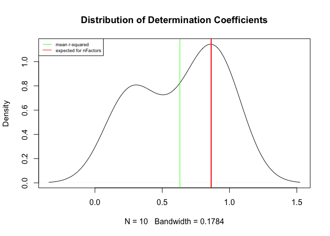<!-- -->

``` r
# visualize factor loadings plotted against each individual asset's first return of the sample
matplot(1:length(portfolio.returns[1,]),factorLoadings,type="l") 
abline(h=0)
```

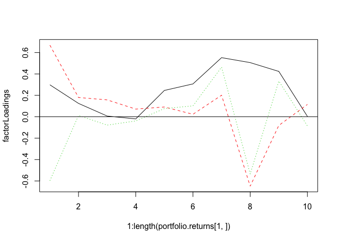<!-- -->

In certain cases, factorLoadings may be all positive or all negative
across assets. In certain cases, it will depend on the asset for a given
factorLoading.

### Approximation of stock returns for the first day of the time sample

``` r
approximations.day1 <- factorScores[1,]%*%t(factorLoadings) + zeroLoading 
# plotting approximations for day one versus actual day one
plot(1:length(portfolio.returns[1,]),portfolio.returns[1,]) 
points(1:length(portfolio.returns[1,]),approximations.day1,col="red")
```

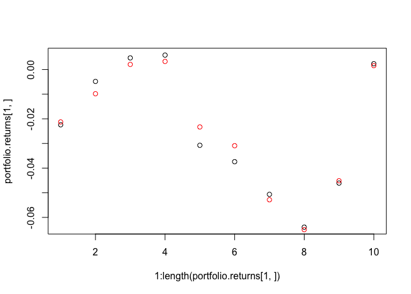<!-- -->

### Approximation of stock returns based on first risk factor (PC1)

``` r
approximations.PC1 <- factorScores[,1]%*%t(factorLoadings[,1]) + zeroLoading 
# plotting approximations for day one versus actual day one
plot(1:length(portfolio.returns),portfolio.returns) 
points(1:length(portfolio.returns),approximations.PC1,col="red")
```

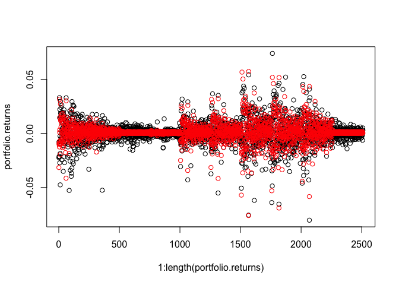<!-- -->

### Plot concentration ellipse for first two factors, denoting 86th and 99th percentiles

``` r
dtel <- dataEllipse(factorScores[,1:2],levels=c(.99,.86466),xlim=c(-.5,.5),ylim=c(-.3,.5))
```

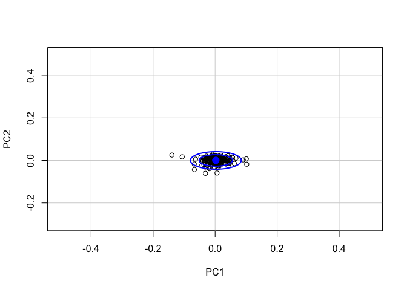<!-- -->

``` r
# or alternatively:
plot(factorScores[,1:2],xlim=c(-.5,.5),ylim=c(-.3,.5)) 
lines(dtel$`0.99`,col="red") 
lines(dtel$`0.86466`,col="blue")
```

<!-- -->

### Create four scenarios corresponding to the extreme points on the 99% concentration ellipse:

``` r
# west scenario is values corresponding to 1st percentile of first PC
W <- dtel$`0.99`[which.min(dtel$`0.99`[,1]),] 
# east scenario is values corresponding to 99th percentile of the first PC
E <- dtel$`0.99`[which.max(dtel$`0.99`[,1]),] 
# south scenario is values corresponding to 1st percentile of the second PC
S <- dtel$`0.99`[which.min(dtel$`0.99`[,2]),] 
# north scenario is values corresponding to the 99th percentile of the second PC
N <- dtel$`0.99`[which.max(dtel$`0.99`[,2]),] 
(scenarios.99th <- rbind(W,E,N,S))
```

    ##               x             y
    ## W -0.0796673569  0.0026954433
    ## E  0.0843094142  0.0001530556
    ## N -0.0002840314  0.0414322045
    ## S -0.0002840314 -0.0411260933

``` r
# plotting on ellipse
plot(factorScores,xlim=c(-.5,.5),ylim=c(-.3,.5)) 
lines(dtel$`0.99`,col="red") 
points(scenarios.99th,pch=16,col="blue")
```

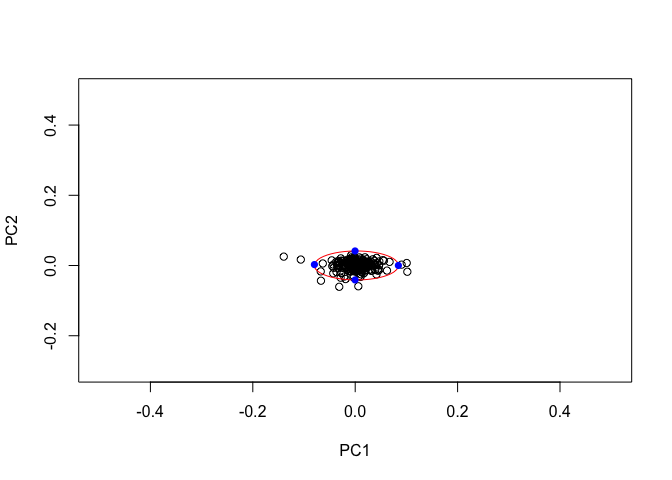<!-- -->

``` r
# calculating and plotting returns: take scenario values and transform back to log returns via factorLoadings
approximationsW <- scenarios.99th["W",]%*%t(factorLoadings[,1:2])+zeroLoading 
approximationsE <- scenarios.99th["E",]%*%t(factorLoadings[,1:2])+zeroLoading 
approximationsN <- scenarios.99th["N",]%*%t(factorLoadings[,1:2])+zeroLoading 
approximationsS <- scenarios.99th["S",]%*%t(factorLoadings[,1:2])+zeroLoading 

# worst case scenario
plot(1:length(approximationsW),approximationsW,col="orange",pch=16,ylim=c(-.05,.05),ylab="Scenario Approximations",xlab="Index") 
# best case
points(1:length(approximationsW),approximationsE,col="magenta",pch=16) 
# second best
points(1:length(approximationsW),approximationsN,col="blue",pch=16) 
# second worst
points(1:length(approximationsW),approximationsS,col="green",pch=16) 
abline(h=0)
```

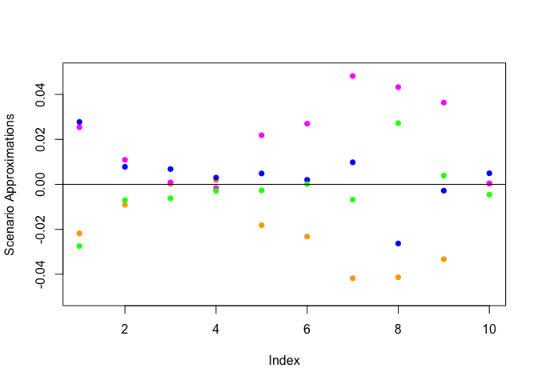<!-- -->

``` r
rbind(TotalReturns=c(W=sum(approximationsW), E=sum(approximationsE), N=sum(approximationsN), S=sum(approximationsS)),
      AverageReturns=c(W=mean(approximationsW), E=mean(approximationsE), N=mean(approximationsN),S=mean(approximationsS)))
```

    ##                          W          E           N            S
    ## TotalReturns   -0.18673533 0.21260343 0.037706044 -0.026568578
    ## AverageReturns -0.01867353 0.02126034 0.003770604 -0.002656858

### Explore Pearson correlations between assets

``` r
corr.matrix <- cor(portfolio.returns)
ord <- order(corr.matrix[1,])
xc <- corr.matrix[ord, ord]
colors <- c("#A50F15","#DE2D26","#FB6A4A","#FCAE91","#FEE5D9","white", "#EFF3FF","#BDD7E7","#6BAED6","#3182BD","#08519C")
plotcorr(xc, col=colors[5*xc + 6])
```

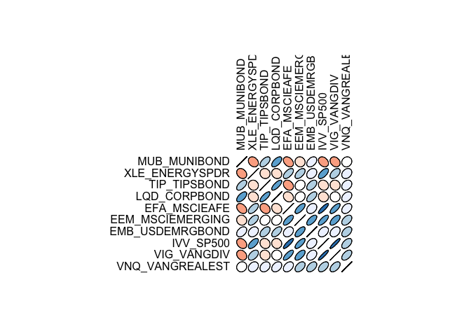<!-- -->

### Pearson correlation after removing the influence of the first factor (hedge w.r.t the first factor):

``` r
corr.matrix.pear <- cor((portfolio.returns-approximations.PC1)) 
ord <- order(corr.matrix.pear[1,])
xc <- corr.matrix.pear[ord, ord]
colors <- c("#A50F15","#DE2D26","#FB6A4A","#FCAE91","#FEE5D9","white", "#EFF3FF","#BDD7E7","#6BAED6","#3182BD","#08519C")
plotcorr(xc, col=colors[5*xc + 6])
```

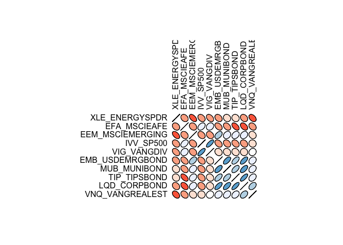<!-- -->

### Spearman correlation after removing the influence of the first factor (hedge w.r.t the first factor):

``` r
corr.matrix.spear <- cor((portfolio.returns-approximations.PC1),method="spearman") 
ord <- order(corr.matrix.spear[1,])
xc <- corr.matrix.spear[ord, ord]
colors <- c("#A50F15","#DE2D26","#FB6A4A","#FCAE91","#FEE5D9","white", "#EFF3FF","#BDD7E7","#6BAED6","#3182BD","#08519C")
plotcorr(xc, col=colors[5*xc + 6])
```

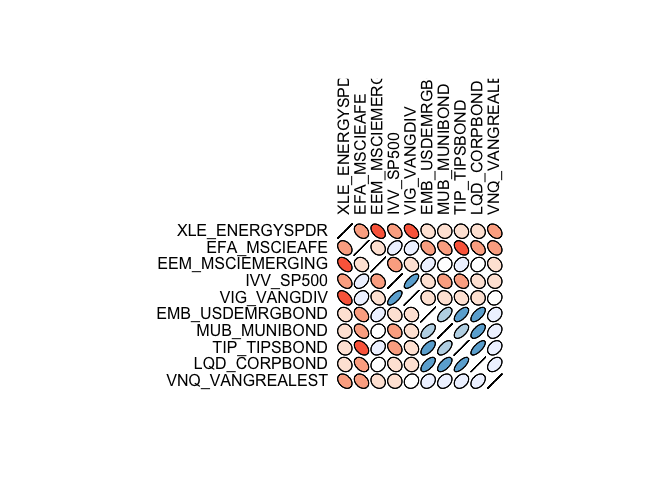<!-- -->

### Kendall correlation after removing the influence of the first factor (hedge w.r.t the first factor):

``` r
corr.matrix.kend <- cor((portfolio.returns-approximations.PC1),method="kendall") # n_comonotonic pairs vs. n_countermonotonic pairs 
ord <- order(corr.matrix.kend[1,])
xc <- corr.matrix.kend[ord, ord]
colors <- c("#A50F15","#DE2D26","#FB6A4A","#FCAE91","#FEE5D9","white", "#EFF3FF","#BDD7E7","#6BAED6","#3182BD","#08519C")
plotcorr(xc, col=colors[5*xc + 6])
```

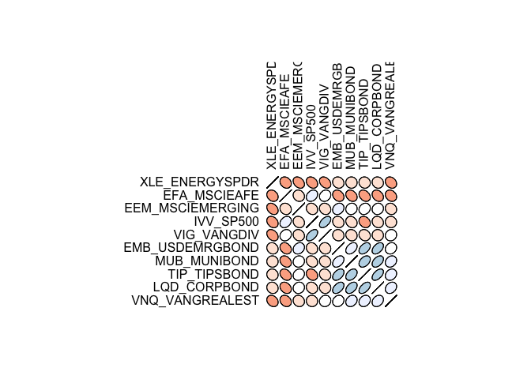<!-- -->

### Plot Pearson vs. Spearman and Pearson vs. Kendall

``` r
pear.v.spear <- corr.matrix.pear-corr.matrix.spear
ord1 <- order(pear.v.spear[1,])
xc1 <- pear.v.spear[ord1, ord1]
colors <- c("#A50F15","#DE2D26","#FB6A4A","#FCAE91","#FEE5D9","white", "#EFF3FF","#BDD7E7","#6BAED6","#3182BD","#08519C")
plotcorr(xc1, col=colors[5*xc1 + 6])
```

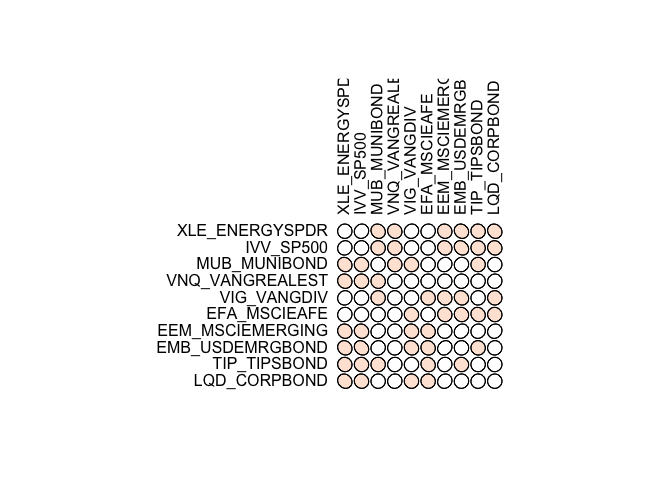<!-- -->

``` r
pear.v.kend <- corr.matrix.pear-corr.matrix.kend
ord2 <- order(pear.v.kend[1,])
xc2 <- pear.v.kend[ord2, ord2]
colors <- c("#A50F15","#DE2D26","#FB6A4A","#FCAE91","#FEE5D9","white", "#EFF3FF","#BDD7E7","#6BAED6","#3182BD","#08519C")
plotcorr(xc2, col=colors[5*xc2 + 6])
```

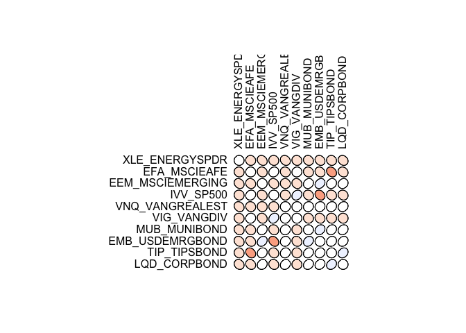<!-- -->

Spearman and, in particular, Kendall shows slightly higher correlation
than Pearson.

### Plot empirical copula

``` r
pairs(apply((portfolio.returns-approximations.PC1)[,1:10],2,rank))
```

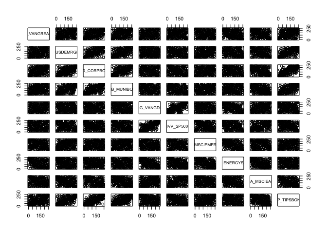<!-- -->

Empirical copula show some nonlinear dependency between assets such as
VANREAL and ENERGY.
